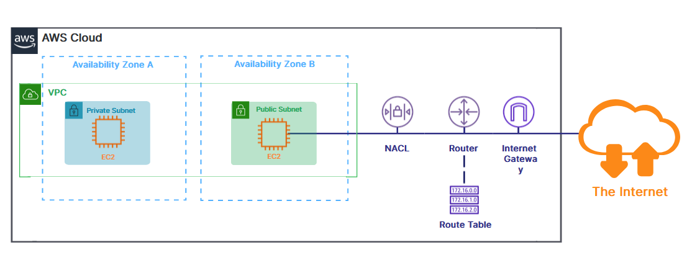
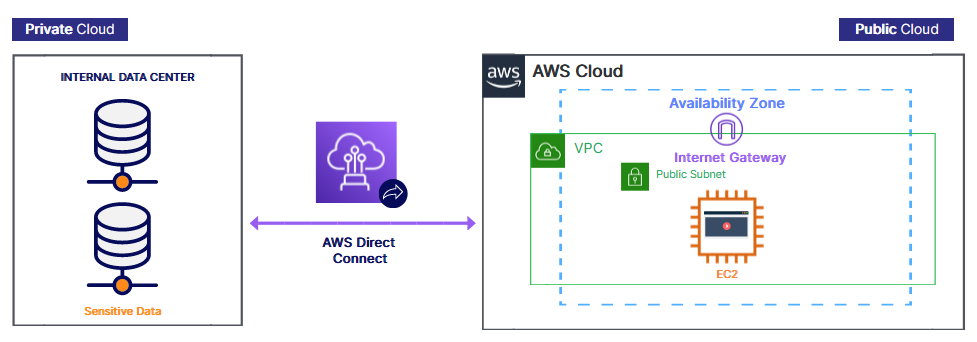
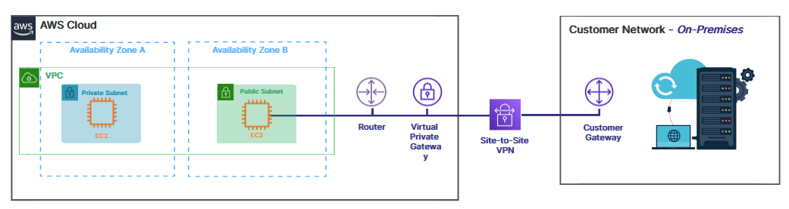
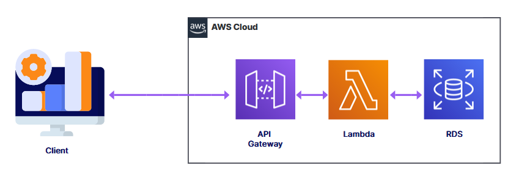

### Lambda
- pay only for compute time used, and request count
- one million free lambda calls each month

```python
import json

def lambda_handler(event, context):
    message = 'Hello {} {}! Keep being awesome!'.format(event['first_name'], event['last_name'])
    
    # Print to CloudWatch logs
    print(message)
    
    return {
        'message' : message
    }
```

### Fargate
- Serverless compute engine for containers

### Lightsail
- Quickly launch preconfigured applications for small projects

### Outposts
- Allows you to run cloud services in your internal data center

### Batch
- Process large workloads in smaller chunks

### Simple Storage Service (S3)
- Bucket or object level access
  - ACL
  - bucket policy
  - access point policies
- Regional service
- Bucket names globally unique
- Durability 11 9s
- Availability 99.99%

- Classes
  - Standard: for regularly accessed data
  - Intelligent Tiering (IT): new programs, or unknown access requirements
  - Infrequent Access (IA): accessed less frequently, but requires rapid access, cheaper than S3 Standard
  - One Zone IA: 20% less than s3 standard, 99.5% availability
  - Glacier: long term, low cost, 3 retriaval options 1-5 min, 3-5 hr, 5-12 hr
  - Glacier deep archive: 2 retriaval options 12 hrs, 48 hrs
  - Outpost: on site storage

- Usage
  - Static websites
  - Data archive
  - Analytics systems
  - Mobile applications

### EC2 Storage
**Elastic Block Store (EBS)**
- Volume that can be attached or removed from instance
- Data persist when the instance is not running
- One AZ
- One instance in the same AZ
- Recommended for:
  - Quickly accessible data
  - Running a DB on an instance
  - Long-term data storage
- Like a USB flash drive

**Instance store**
- Local storage
- Physically attached
- Data loss occurs when EC2 instance is stopped, hibernated, or terminated
- Faster, Higher I/O speeds
- Recommended for:
  - Temporary storage needs
  - Data replication across multiple instances

**Elastic File System (EFS)**
- Serverless
- Network file system for sharing files
- Linux only
- More expensive than EBS
- Recommended for:
  - Main directories for business-critical apps
  - Lift-ans-shift existing enterprise apps


### Other Storage
**Storage Gateway**
- Connect on-premises and cloud data
- Supports a hybrid model
- Recommended for:
  - Moving backups to the cloud
  - Reducing costs for hybrid cloud storage
  - Low latency access to data

**AWS Backup**
- Helps manage data backups across multiple AWS services
- Integrates with:
  - EC2
  - EBS
  - EFS
  - More...
- Create a backup plan that includes frequency and retention

### Content Delivery Networks (CDN)
**Cloudfront**
- Global, or restricted on location
- Low latency
- Static or dynamic web content
- Uses edge locations to cache content
- Uses
  - S3 static website
  - Prevent certain web attacks like ddos
  - IP address blocking through geo-restrictions

**Amazon Global Accelerator**
- Sends your users through AWS global network when accessing your content
- 60% performance boost
- Auto-reroutes traffic to healthy available regional endpoints

**S3 Transfer Acceleration**
- Improves content uploads and downloads to and from S3 buckets
- Fast transfer over long distances
- Uses cloudfront's globally distributed edge locations
- Customers around the world can upload to a central bucket

### Virtual Private Clouds (VPC)
- Private virtual network
- Launch resources inside the VPC
- Isolates and protects resources
- Spans AZs in a region
- VPC pairing allows you to connect two VPCs together



### VPC Lab
1. Create a custom VPC
   - click on your vpc
   - click create vpc
   - give name
   - give cidr block
   - click create vpc
2. Create a public subnet
   - click Subnets
   - click create subnet
   - associate to VPC from dropdown
   - give name
   - associate with AZ
   - enter cidr range
   - click create subnet
   - select subnet
   - click on actions
   - click edit subnet settings
   - click Enable auto-assign public IPv4 address
   - click save
3. Add internet gateway
   - click internet gateway
   - click create internet gateway
   - give name
   - click create internet gateway
   - go to actions
   - click attach to vpc
   - select vpc from dropdown
   - click attach internet gateway
4. Add routes
   - click on route tables
   - click on create route table
   - give name
   - select vpc from dropdown
   - click create route table
   - click edit routes
   - click add route
   - destination is 0.0.0.0/0
   - target is your internet gateway
   - click save changes
5. Associate route table with subnet
   - click on route
   - click subnet associations tab
   - select subnet
   - click save associations
5. launch EC2 instance using this vpc

### Direct Connect


### Site-to-site VPN


### API Gateway


### Databases
Types:
- Relational
  - RDS
    - Service to easily launch and manage relational databases like:
        - MariaDB
        - Oracle
        - SQLServer
        - Aurora
        - PostgreSQL
        - MySQL
  - Aurora
    - Supports only MySQL and PostgreSQL
    - Scales automatically
    - manages by RDS
- NoSQL
  - DynamoDB
    - Fully managed
    - NoSQL key-vaule and document DB
    - Serverless
    - Non-relational
    - Scales automatically
- Graph
  - Neptune
    - Fully managed
    - Serverless
    - Fast and reliable
- In-memory
  - Elasticache
    - Fully managed
    - Compatible with Redis and Memcached
    - Data can be lost
    - High performance and low latency
- Document
  - DocumentDB
    - Fully managed
    - Supports MongoDB
    - Serverless
    - Non-relational

### Migration and Transfers
- **Database Migration Service (DMS)**
  - Helps migrate databases to or within AWS
  - Continuous data replication
  - Supports homogeneous and heterogeneous migrations
  - Options:
    - Oracle to Aurora MySQL
    - Oracle to Oracle
    - RDS Oracle to Aurora MySQL
- **Server Migration Service (SMS)**
  - Migrate on-premises servers to AWS
  - Server saved as a new Amazon Machine Image (AMI)
  - Use AMI to launch servers as EC2 instances

### Snow Family
- **Snowcone**
  - 8 terabyte
  - Offline shipping
  - Online with DataSync
- **Snowball / Snowball Edge**
  - Petabyte-scale data transport solution
  - transfer data in and out
  - Cheaper than internet transfer
  - Edge supports EC2 and Lambda
- **Snowmobile**
  - Multi petabyte or exabyte scale
  - Shipping container

### Datasync
- Online data transfer from on-premises to AWS storage services like S3 or EFS
- Up to 10x faster than open-source tools
- Copy over Direct Connect or the internet
- Copy data between AWS storage services
- Replicate data cross-region or cross-account

### Data Warehouse
- Data storage solution
- Aggregates massive amounts of historical data from disparate sources
- Support:
  - Querying
  - Reporting
  - Analytics
  - Business intelligence
- Not used for transaction processing
- **Amazon Redshift**
  - AWS data warehousing solution
  - Improves speed and efficiency
  - Handles exabyte-scale data
  - Used when:
    - Need to consolidate multiple data sources for reporting
    - Want to run a database that doesn't require real-time transaction processing (insert, update, and delete)
- **Athena**
  - Query service for AWS S3
  - Analyze S3 data using SQL
  - Pay per query
  - Considered serverless
- **Glue**
  - Prepares your data for analytics
  - Extract, Transform, Load (ETL) service
  - Prepare and load data
  - Helps to better understand your data
- **Kinesis**
  - Analyze data and video streams in real time
  - Supports:
    - Video
    - Audio
    - Application logs
    - Website clickstreams
    - IoT
- **Elastic MapReducer (EMR)**
  - Helps you process large amounts of data
  - Process big data
  - Analyze data
  - Works with big data frameworks
- **Data Pipeline**
  - Helps you move data between compute and storage services running either on AWS or on-premises
  - Move data:
    - At specific intervals
    - Based on conditions
  - Sends notifications on success or failure
- **QuickSight**
  - Helps you visualize your data
  - Build interactive dashboards
  - Embed dashboards in your applications

### Machine Learning
- **Rekognition**
  - Image and video analysis
  - Identify custom labels and images in videos
  - Face and text detection in images and videos
- **Comprehend**
  - Natural Language Processing (NLP) service
  - Find relationships in text
- **Poly**
  - Turns text into speech
- **SageMaker**
  - Helps you build, train, and deploy machine learning tools quickly
  - Prepare data for models
  - Train and deploy models
  - Provides deep learning Amazon Machine Images
- **Translate**
  - Provides language translation
- **Lex**
  - Helps you build conversational interfaces like chatbots
  - Recognizes speech and understands language
  - Powers Amazon Alexa

### Developer Tools
- **Cloud9**
  - Web browser-based code IDE
- **CodeCommit**
  - Source control system for private Git repositories
  - Create repositories to store code
  - Commit, branch, and merge code
- **CodeBuild**
  - Allows you to build and test your code
  - Compiles source code and runs tests
  - Enables continuous integration and delivery
  - Produces build artifacts ready to be deployed
- **CodeDeploy**
  - Manages the deplyoment of code to compute services in the cloud or on-premises
  - Deploys to:
    - EC2
    - Fargate
    - Lambda
    - On-premises
  - Maintains application uptime
- **CodePipeline**
  - Automates the software release process
    - Dev --> Test --> Prod
  - Quickly deliver new features and updates
  - Integrates with
    - CodeBuild to run builds and unit tests
    - CodeCommit to retrieve source code
    - CodeDeploy to deploy your changes
- **X-Ray**
  - Helps you debug production applications
  - Analyze and debug production applications
  - Map application components
  - View requests end-to-end
- **CodeStar**
  - Helps developers collaboratively work on development projects
  - Developers connect their development environment
  - Contains issue tracking dashboard
  - Integrates with:
    - CodeCommit
    - CodeBuild
    - CodeDeploy

### Deployment and Infrastructure Management
- **CloudFormation**
  - Allows you to provision AWS resources using Infrastructure as Code (IaC)
  - Uses CloudFormation templates (you create) to build a stack in the cloud
- **Elastic Beanstalk**
  - Orchestration service that provisions resources
  - Automatically handles the deployment
  - Monitors application health via a health dashboard
- **OpsWorks**
  - Allows you to define software installation scripts and automate configuration for you application servers
  - Deploy code and manages applications
  - Manage on-premises servers or EC2 instances
  - Works with:
    - Chef
    - Puppet
- **Marketplace**
  - Digital catalog of prebuilt solutions you can purchase or license

### Messaging and Integration Services
- **Simple Queue Service (SQS)**
  - Message queuing service that allows you to build loosely coupled systems
  - Allows component-to-component communication using messages
  - Multiple components (or producers) can add messages to the queue
  - Messages are processed in an ansynchronous manner
- **Simple Notification Service**
  - Send email and text messages
  - Publish messages to a topic
  - Subscribers receive messages
- **Simple E-mail Services**
  - Ideal choice for marketing campaigns or professional E-mails
  - Unlike SNS, SES sends HTML E-mails

### Auditing, Monitoring, and Logging
- **CloudWatch**
  - Collects metrics, logs, and events
  - Detects anomalies in your environment
  - Set alarms
  - Visualize logs
  - Services:
    - **Cloudwatch Alarms**
    - **Cloudwatch Logs**
    - **Cloudwatch Metrics**
    - **Cloudwatch Events**
- **CloudTrail**
  - Tracks user activity and API calls within your account
  - Log and retain account activity
  - Track activity through the:
    - Console
    - SDK's
    - CLI
  - Identify which user made changes
  - Detect unusual activity in your account
  - Can track:
    - User
    - Event time
    - Event name
    - IP address
    - Access key
    - Region used
    - Error code

### Additional Services
- **Amazon WorkSpaces**
  - Allows you to host virtual desktops in the cloud
  - Virtualize Windows or Linux
  - Enables employees to work from home
- **Amazon Connect**
  - A cloud contact certer service
  - Provides customer service functionality
  - Iimporves productivity of help desk agents

### Well-Architected Framework
- Five Pillars
  - Operational Exellence
  - Security
  - Reliability
  - Performance Efficiency
  - Cost Optimization

### Identity and Access Management (IAM)
- Allows you to control access to your AWS services and resources
- Helps you secure your cloud resources
- You define who has access
- You define what they can do
- A free global service
- **Identities**
  - Who can access your resources
  - Root user
  - Individual Users
  - Groups
  - Roles
- **Access**
  - What resources they can access
  - Policies
  - AWS managed policies
  - Customer managed policies
  - Permissions boundaries

### IAM Permissions
- **Roles**
  - Define access permissions
  - Temporarily assumed by an IAM user or service
  - Help you avoid sharing long-term credentials like access keys
  - Protect your resources from unauthorized access
- **Policies**
  - Can manage permissions for IAM users, groups, and roles
  - Created witha policy document in JSON format and attaching it
- **IAM Best Practices**
  - Enable MFA for privileged users
  - Implement strong password policies
  - Create individual users instead of using root
  - Use roles for Amazon EC2 instances
- **IAM Credential Report**
  - Lists all users in your account and the status of their various credentials
  - Lists status of:
    - Passwords
    - Access keys
    - MFA devices
  - Used for auditing and compliance

### Application Security Services
- **Web Application Firewall (WAF)**
  - Protects your web applications against:
    - Common web attacks
    - Common attack patterns
    - SQL injection
    - Cross-site scripting
- **Shield**
  - A managed DDOS protection service
  - Always-on protection
  - Standard is free
    - Protection against common attacks
  - Advanced is paid service
    - Enhanced protections
    - 24/7 access to AWS experts
    - Provided on these services:
      - CloudFront
      - Route 53
      - Elastic Load Balancing
      - AWS Global Accelerator
- **Macie**
  - Helps you discover and protect sensitive data
  - Uses machine learning
  - Evaluates S3 environment
  - Uncovers personally identifiable information (PII)

### Additional Security Services
- **Config**
  - Allows you to assess, audit, and evaluate the configurations of your resources
  - Track configuration changes over time
  - Delivers configuration history file to S3
  - Notifications via Simple Notification Service (SNS) of every configuration change
- **GuardDuty**
  - An intelligent threat detection system that uncovers unauthorized behavior
  - Uses machine learning
  - Built-in detection for EC2, S3, IAM
  - Reviews CloudTrail, VPC Flow Logs, and DNS logs
- **Inspector**
   - Works with EC2 instances to uncover and report vulnerabilities
   - Agent installed on EC2 instance
   - Reports vulnerabilities found
   - Checks access from the internet, remote root login, vulnerable software versions, etc...
- **Artifact**
  - Offers on-demand access to AWS security and compliance reports
  - Central repository for compliance reports from third-party auditors
  - Service Organization Controls (SOC) reports
  - Payment Card Industry (PCI) reports
- **Cognito**
  - Helps control access to mobile and web applications
  - Provides authentication and authorization
  - Helps you manage users
  - Assists with user sign-up and sign-in
  - Allows users to sign in to your application with credentials from social media websites

### Encryption
- **Key Management Service (KMS)**
  - AWS manages your keys
  - Key generator
  - Store and control keys
  - Manages encryption keys
  - Automatically enabled for certain services
- **CloudHSM**
  - You manage your keys
  - A hardware security module (HSM) used to generate encryption keys
  - Dedicated hardware for security
  - Generate and manage your own encryption keys
  - AWS does not have access to your keys
- **Secrets Manager**
  - Allows you to manage and retrieve secrets (passwords or keys)
  - Rotate, manage, and retrieve secrets
  - Encrypt secrets at rest
  - Integrates with services like RDS, Redshift, and DocumentDB
  - Accessable through an API

### Pricing
- Compute
  - Billed hourly from launch to termination
- Storage
  - Amount of data stored in the cloud
- Outbound data transfer
  - Usually no cost for data transfers into cloud or between AWS services
  - Charged at the outbound data transfer rate
### Free Offer Types
- 12 Months free after creation of account
- Always free
- Trials
### EC2 Pricing
- On-demand
  - Pay by the hour or by the second without pre-paying
- Savings Plan
  - Commit to usage measured per hour for a 1 or 3 year term
- Reserved Instances
  - Commit to usage for 1 or 3 years; pay regardless of usage
- Spot Instances
  - Only launch if spare capacity is available
- Dedicated Hosts
  - An entire physical server just for you
### Lambda pricing
- Number of requests (includes test invokes from the console)
- Code execution time
  - From execution start, in response to events, to stop
- Always free
  - 1 million free requests per month
### S3 pricinag
- Storage class
  - Based on chose class
- Storage
  - Number and size of objects
- Data transfer
  - Amount of data transferred out of S3 region
- Request and data retrieval
  - Requests made for data and amount of requests
### RDS Pricing
- Based on:
  - Running clock hours
  - Type of database
  - Storage
  - Purchase type
  - Database count - Number of databases
  - API requests
  - Deployment type
  - Data transfer
    - Inbound is free
    - Charged for outbound data

### Application Discovery Service
- Helps you plan migration projects to the AWS cloud
- Plan migration projects
- Used to estimate total cost of ownership
- Works with other services to migrate servers

### Ways to reduce TCO using AWS
- Minimize large capital expenditures
- Utilize reserve instances
- Right size your resources

### AWS Price List API
- Allows you to query the price of AWS services
- Receive price alerts when prices change

### Billing Services
- **Budgets**
  - Allows you to set custom budgets that alert you when your costs or usage exceed your budgeted amount
  - Improve planning and cost control
  - Types of budgets:
    - Cost
      - Plan how much you want to spend on a service
    - Usage
      - Plan how much you want to use on one or more services
    - Reservation
      - Set Reserve Instances or Savings Plans utilization or coverage targets
  - You can configure budget alerts
- **Cost and Usage Report**
  - Contains the most comprehensive set of cost and usage data
  - Downloadable detailed and comprhensive report
  - Lists usage for each service category
  - Aggregate usage data on a daily, hourly, or monthly level
- **Cost Explorer**
  - Allows you to visualize and forecast your costs and usage over time
  - Visualize costs over time
  - View past 12 months
  - Forecast for up to 3 months
  - Can analyze your EC2 usage over the past 7, 30, or 60 days
  - View by searching for "AWS Cost Explorer"
- **Cost Allocation Tags**
  - Useful for tracking spend
  - Allow you to:
    - Label resources using a key and value pair
    - Track costs via the cost allocation report

### Governance Services
- Help you maintain control over cost, compliance, and security across your AWS accounts
- **Organizations**
  - Allows you to centrally manage multiple AWS accounts under one umbrella
  - Group multiple accounts
  - Single payment for all accounts
  - Automate account creation
  - Allocate resources and apply policies across accounts
  - **Service Control Policies (SCP)**
    - Used to enforce permissions you want everyone in the organization to follow
  - Heirarchy:
    - Master Payer / Root Organization
      - Pays for all member accounts using consolidated billing
    - Organization Units (OU)
      - Grouping of AWS accounts that are similar
    - Member accounts
      - Standard individual AWS accounts that contain your AWS resources
  - Benefits
    - Consolidated billing
      - Receive one bill for multiple accounts
    - Cost savings
      - Receive volume discounts since usage is combined across accounts
    - Account governance
      - You have a quick and automated way to create accounts or invite existing accounts
- **Control Tower**
  - Sits on top of "AWS Organizations"
  - Helps you ensure your accounts conform to company-wide policies
  - Helps set up new accounts using a multi-account strategy
  - Works directly with AWS Organizations
  - Enforces the best use of services across accounts
  - Provides a dashboard to manage accounts
- **Systems Manager**
  - Gives you visibility and control over your AWS resources
  - Automate operational tasks on your resources
  - Group resources and take action
  - Patch and run commands on multiple EC2 instances or manage RDS instances
- **Trusted Advisor**
  - Provides real-time guidance to help you provision your resources following AWS best practices
  - Checks your account and makes recommendations
  - Helps you see service limits
  - Helps you understand best practices
  - Popular checks:
    - Free:
      - Unrestricted access for specific ports on EC2 instances
      - S3 bucket permissions to determine if there is public access
      - MFA on your root account
      - RDS public snapshots
    - Require Enterprise or Business support:
      - IAM password policy
      - Service usage greater than 80% over service limit
      - Exposed access keys
      - CloudFront content delivery optimization
- **License Manager**
  - Helps you manage software licenses
  - Manage on-premises and AWS licensed
  - Tracks licenses for Oracle, Microsoft, SAP, and more
- **Certificate Manager**
  - Helps you provision and manage SSL/TLS certificates
  - Provides public and private certificates for free
  - Integrates with:
    - Elastic Load Balancing
    - API Gateway
    - And more...

### Using Management Services
- **Managed Services**
  - Helps you efficiently operate your AWS infrastructure
  - Augments your internal staff
  - Provides ongoing management of your infrastructure
  - Reduces operational risks and overhead
- **Professional Services**
  - Helps enterprise customers move to a cloud-based operating model
  - Proposes solutions
  - Architects solutions
  - Implements solutions
- **AWS Partner Network (APN)**
  - A global community of approved partners that offer software solutions and consulting services for AWS
  - Offers technology partners that provide software solutions
  - Provides consulting partners that offer professional services
  - Find approved vendors with deep AWS knowledge
- **Marketplace**
  - Is a digital catalog of prebuilt solutions you can purchase or license
  - Buy third-party software
  - Sell solutions to AWS customers
  - Search the catalog of software listings and install with the click of a button
- **Personal Health Dashboard**
  - Alerts you to events that might impact your AWS environment
  - Provides troubleshooting guidance
  - Feedback tailored to your specific environment

### Exploring Support Plans
- **Basic**
  - Included for free with all AWS accounts
  - Access to:
    - Account and billing
    - Service limit increases
  - 24/7 access via email only
- **Developer**
  - Starts at $29 a month
  - Recommended for testing and developing
  - Access to:
    - Account and billing
    - Service limit increases
    - Technical support
  - 1 Primary contact
  - Unlimited support cases
  - Access to a cloud support associate:
    - During business hours
    - E-mail only
  - Response times
    - < 24 hours for general guidance
    - < 12 for system impaired
- **Business**
  - Starts at $100 a month
  - Recommended for production workloads
  - Access to:
    - Account and billing
    - Service limit increases
    - Technical support
  - Unlimited contacts
  - Unlimited cases
  - Full set of trusted advisor checks
  - Access to a cloud support associate:
    - 24/7
    - E-mail
    - Phone
    - Chat
  - Response times
    - < 24 hours for general guidance
    - < 12 for system impaired
    - < 4 for production system impaired
    - < 1 for production system down

- **Enterprise**
  - Starts at $15K a month
  - Recommended for business or mission-critical production workloads
    - Access to:
    - Account and billing
    - Service limit increases
    - Technical support
  - Unlimited contacts
  - Unlimited cases
  - Full set of trusted advisor checks
  - Technical account manager (TAM)
  - Concierge support team
  - Infrastructure event management
    - Access to a cloud support associate:
    - 24/7
    - E-mail
    - Phone
    - Chat
  - Response times
    - < 24 hours for general guidance
    - < 12 for system impaired
    - < 4 for production system impaired
    - < 1 for production system down
    - < 15 minutes for business-critical system down

- **Support Case Types**
  - Account and billing
  - Service limit increase
  - Technical support
- AWS support does not allow cases for:
  - Code development
  - Debugging custom software
  - Performing system administration tasks
