# AWS Certified Developer Associate Notes

### Resources:
- [AWS Certified Developer Associate Exam Webpage](https://aws.amazon.com/certification/certified-developer-associate/)
- [AWS IAM Policy Simulator](https://policysim.aws.amazon.com)
- [AWS Pricing Calculator](https://calculator.aws/#/)
- [AWS EBS Volume Types](https://docs.aws.amazon.com/AWSEC2/latest/UserGuide/ebs-volume-types.html)
- [AWS CLI Command Reference](https://docs.aws.amazon.com/cli/latest/reference/)
- [AWS S3 Storage Classes](https://aws.amazon.com/s3/storage-classes/)
- [AWS Lambda](https://aws.amazon.com/lambda/)
- [Amazon States Language](https://docs.aws.amazon.com/step-functions/latest/dg/concepts-amazon-states-language.html)
- [AWS DynamoDB](https://aws.amazon.com/dynamodb/)
- [Practicing Continuous Integration and Continuous Delivery on AWS](https://docs.aws.amazon.com/whitepapers/latest/practicing-continuous-integration-continuous-delivery/practicing-continuous-integration-continuous-delivery.pdf)
- [Running Containerized Microservices on AWS](https://d1.awsstatic.com/whitepapers/DevOps/running-containerized-microservices-on-aws.pdf)
- [The Twelve-Factor App](https://12factor.net/)
- [CloudFormation Template Snippets](https://docs.aws.amazon.com/AWSCloudFormation/latest/UserGuide/CHAP_TemplateQuickRef.html)
- [AWS Blog](https://aws.amazon.com/blogs/?awsf.blog-master-category=*all&awsf.blog-master-learning-levels=*all&awsf.blog-master-industry=*all&awsf.blog-master-analytics-products=*all&awsf.blog-master-artificial-intelligence=*all&awsf.blog-master-aws-cloud-financial-management=*all&awsf.blog-master-blockchain=*all&awsf.blog-master-business-applications=*all&awsf.blog-master-compute=*all&awsf.blog-master-customer-enablement=*all&awsf.blog-master-customer-engagement=*all&awsf.blog-master-database=*all&awsf.blog-master-developer-tools=*all&awsf.blog-master-devops=*all&awsf.blog-master-end-user-computing=*all&awsf.blog-master-mobile=*all&awsf.blog-master-iot=*all&awsf.blog-master-management-governance=*all&awsf.blog-master-media-services=*all&awsf.blog-master-migration-transfer=*all&awsf.blog-master-migration-solutions=*all&awsf.blog-master-networking-content-delivery=*all&awsf.blog-master-programming-language=*all&awsf.blog-master-sector=*all&awsf.blog-master-security=*all&awsf.blog-master-storage=*all)

### How to guides:
- [Attach an Amazon EBS volume to an instance](https://docs.aws.amazon.com/AWSEC2/latest/UserGuide/ebs-attaching-volume.html)
- [Create an Application Load Balancer](https://docs.aws.amazon.com/elasticloadbalancing/latest/application/create-application-load-balancer.html)
- [Run commands on your Linux instance at launch](https://docs.aws.amazon.com/AWSEC2/latest/UserGuide/user-data.html)

### Sections:
- [Identity Access Management (IAM)](#identity-access-management-iam)
- [Elastic Cloud Compute (EC2)](#elastic-cloud-compute-ec2)
- [Elastic Block Storage (EBS)](#elastic-block-storage-ebs)
- [Elastic Load Balancer](#elastic-load-balancer)
- [Route 53](#route-53)
- [AWS CLI Pagination](#aws-cli-pagination)
- [Relational Database Service (RDS)](#relational-database-service-rds)
- [Amazon Aurora](#amazon-aurora)
- [Amazon Dynamo DB](#amazon-dynamo-db)
- [Elasticache](#elasticache)
- [Systems Manager Parameter Store](#systems-manager-parameter-store)
- [Simple Storage Service (S3)](#simple-storage-service-s3)
- [CloudFront](#cloudfront)
- [Serverless Solutions](#serverless-solutions)
- [Lambda](#lambda)
- [API Gateway](#api-gateway)
- [X-Ray](#x-ray)
- [Key Management Service (KMS)](#key-management-service-kms)
- [Simple Queue Service (SQS)](#simple-queue-service-sqs)
- [Simple Notification Service (SNS)](#simple-notification-service-sns)
- [Simple Email Service (SES)](#simple-email-service-ses)
- [Kinesis](#kinesis)
- [Elastic Beanstalk](#elastic-beanstalk)
- [AWS Developer Tools](#aws-developer-tools)
- [CodeArtifact](#codeartifact)
- [Serverless AWS Services](#serverless-aws-services)
- [CloudFormation](#cloudformation)
- [Amazon Cognito](#amazon-cognito)
- [CloudWatch](#cloudwatch)

# Identity Access Management (IAM)
### Overview
- Centralized control of your AWS account
- Shared access to your AWS account
- Granular permissions
- Supports:
  - Multi-factor authentication
  - Temporary access for users/devices and services, as necessary
  - Password Policies: allows you to set up your own password rotation policy
  - Integrated: integrates with many different AWS services
  - Compliance: Supports PCI DSS compliance
- Users/Groups/Roles
  - Users: think people
  - Groups: collection of users under one set of permissions
  - Roles: You create roles and can then assign them to users, applications, and services to give access to AWS resources.
- Access:
  - User access keys are used for programatic access
  - User name and password are used for console access
- Use the AWS IAM policy simulator for testing permissions
### Identity Federation: supports well-known identity providers sucha as:
- Active Directory
- Facebook
- LinkedIn
### IAM Policy:
- A document that defines one or more permissions
- Can be attached to a:
  - User
  - Group
  - Role
- Types:
  - `AWS managed`
    - AWS defines the permissions in the policy
    - Allows you to assignb appropriate permissions to your users without having to write the policy yourself
    - Attach to multiple users, groups, or roles in the same AWS account or across different accounts
    - Example policies:
      ```
      AmazonDynamoDBFullAccess
      AWSCodeCommitPowerUser
      AmazonEC2ReadOnlyAccess
      ```
  - `Customer managed`
    - The customer defines the permissions in the policy
    - You can attach this policy to multiple users, groups, and roles within your own account
    - Recommended for use cases where the existing AWS managed policies don't meet the needs of your environment
    - Cannot be used outside your account
  - `Inline`
    - The policy is created in a user/group/role specifically for that user/group/role
    - Is embedded in the user, group, or role that it applies
    - There is a strict 1:1 relationship between the entity and the policy
    - When you delete the user, group, or role in which the inline policy is embedded, the policy will also be deleted
    - AWS recommends using managed policies over inline policies
    - The policy must not be inadvertently assigned to any other user, group, or role than the one for which it is intended
    - The policy must only ever be attached to a single user, group, or role
### Security Token Service (STS) Assume-Role-With-Web-Identity
- An API provided by the Security Token Service (STS)
- Returns temporary security credentials for users authenticated by a mobile or web application or using a web IP provider like Amazon, Facebook, Google, etc...
- Regular web applications can use the assume-role-with-web-identity API
  - For mobile applications, Cognito is recommended
- Example workflow:
  1. Application user authenticates to a web ID provider like Facebook
  2. Once, authenticated by the web ID provider, the web ID provider passes back a JSON Web Token (JWT)
  3. The application makes the `assume-role-with-web-identity` API call to STS which hincludes the JWT in the API call
  4. STS exchanges the JWT for temporary AWS credentials (secret key, and access key)
  5. The application uses the temporary AWS credentials to access AWS resources

### Cross-Account Access
- Allows you to delegate access to resources in different AWS accounts that you own
- Manage resource in other accounts
  - Share resources in one account with users in a different account
- IAM Role
  - Create a role in one account to allow access and grant permissions to users in a different account
- Switc Roles
  - Switch roles within the AWS management console - no password is required

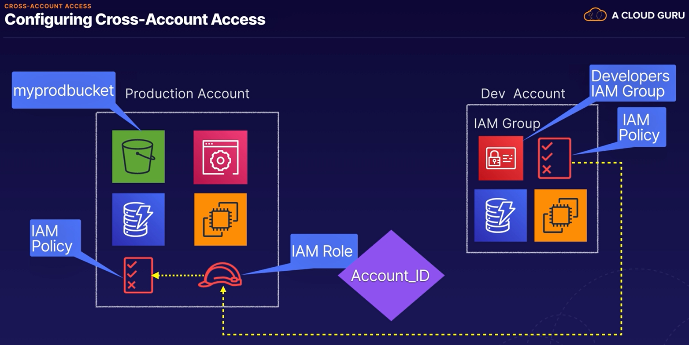

<br>[top of page](#aws-certified-developer-associate-notes)<br>

# Elastic Cloud Compute (EC2)
### Pricing
- `On Demand`
  - Pay by the hour or second
- `Reserved`
  - Reserved capacity for one or three years
  - Up to 72% discount on hourly charge
  - Regional
  - Types:
      - Standard:
        - Cannot change to a different reserved instance type
      - Convertible:
        - Has the option to change to a different reserved instance type of equal or greater value
      - Scheduled:
        - Launch within the time window you define
        - Match your capacity reservation to a predictable recurring schedule that only requires a fraction of a day, week, or month
- `Spot`
  - Purchase unused capacity at a discount of up to 90%
  - Price will fluctuate with supply and demand
  - You set a maximum price that you are willing to pay for the instance
- `Dedicated`
  - Physical EC2 server dedicated for your use
  - Most expensive option
  - Used to meet compliance requirements:
      - Regulations may require solutions that do not use multi-tenant virtualization
  - Great for licensing which does not support multi-tenancy or cloud deployments
  - Can be purchased:
      - On-demand (hourly)
      - Reserved Instances
- `Savings Plans`
  - Save up to 72% on all AWS compute usage regardless of instance type or region
  - Commit to use a specific amount of compute power (measured in $/hour) for a one-year or three-year period
  - Also includes serverless technologies like Lambda and Fargate

### Instance types
- Hardware:
  - Instance type determines the hardware of the host computer used for your instance
- Capabilities:
  - Each instance type offers different compute, memory, and storage capabilities
  - Grouped into instance famalies
- Application Requirements:
  - Select an instance type based on the requirements of the application that you plan to run on your instance

<br>[top of page](#aws-certified-developer-associate-notes)<br>

# Elastic Block Storage (EBS)

### Overview
- Storage volumes you can attach to your EC2 instances
- Use them the same as any system disk
  - Create a filesystem
  - Run a database
  - Run an operating system
  - Store data
  - Install applications

### Mission Critical
- Designed for mission-critical workloads
- Automatically replicated within a single AZ to protect against hardware failures
- Scales with no downtime

### Types
- Solid State Drive (SSD)
  Storage Type | IOPs per Vol | IOPs per GiB
  --|--|--
  GP2 | 16k | 3
  GP3 | 16k | ?
  IO1 | 64k | 50
  IO2 | 64k | 500
  IO2 BE | 256k | 

  - `General Purpose SSD (GP2)`
    - Balance of price and performance
    - Good for boot volumes or developmental
  - `General Purpose SSD (GP3)`
    - Balance of price and performance
    - Good for apps that need high performance at a low cost:
      - MySQL
      - Cassandra
      - Virtual desktop
      - Hadoop analytics
    - Top performance of gp3 is 4x faster than max throughput of gp2
  - `Provisioned IOPS SSD (IO1)`
    - High performance option and the most expensive
    - Designed for I/O-intensive apps:
      - Large databases
      - Latency-sensitive workloads
  - `Provisioned IOPS SSD (IO2)`
    - Latest generation
    - Higher durability and more IOPs than IO1
    - Same price as IO1
    - Uses same as IO1
  - `Provisioned IOPS SSD IO2 Block Express`
    - Storage Area Network (SAN) in the cloud
    - Highest performance - sub-millisecond latency
    - Best for:
      - Largest, most critical, high-performance applications
      - SAP HANA, Oracle, Microsoft SQL Server
      - IBM DB2
- Hard Disk Drive (HDD)
  Storage Type | Baseline IOPs per TB | Burst IOPs per TB | Max IOPs per Vol. 
  --|--|--|--
  SC1 | 12 | 80 | 250
  ST1 | 40 | 250 | 500
  - `Cold HDD (SC1)`
    - Lowest cost option
    - Cannot be a boot volume
    - Best for:
      - Colder data requiring fewer scans per day
      - Apps that need the lowest cost and performance is not a factor
  - `Throughput Optimized HDD (ST1)`
    - Low cost
    - Cost effective way to store mountains of data
    - Cannot be a boot volume
    - Best for:
      - Frequently accessed, throughput-intensive workloads
      - Big data, data wharehouse, ETL, and log processing

### IOPs vs. Throughput
- IOPs
  - Number of read/write ops per second
  - Important for:
    - Quick transactions
    - Low-latency apps
    - Transactional workloads
  - Choose IO1 or IO2
- Throughput
  - Number of bits read or written per second
  - Important for:
    - Large data-sets
    - Large I/O sizes
    - Complex queries
  - Choose ST1

### Volumes
- Virtual hard disks
- Need minimum of 1 volume per EC2 instance (root device volume)
- Location: will always be in the same AZ as the EC2 instance they are attached to
- Resizing: can resize on the fly, but will need to extend the file system in the OS
- Volume Type: can change volume types on the fly

### Snapshot
- Point-in-time copy of a volume
- Exist on S3
- Incremental snapshot: Only the data that has been changed since your last snapshot are moved to S3
- Recommended to stop instance to take a snapshot
- Snapshots of encrypted EBS volumes will be encrypted automatically
- Snapshots can be shared, but only in the region in which they were created
- To share to other region, you need to copy them to the destination region first

### Encryption
- AES-256
- To encrypt volumes and snapshots, AWS uses:
  - AWS Key Management Service (AWS KMS)
  - Customer master keys (CMK)
- Result:
  - Data at rest is encrypted in the volume
  - Data in flight between instance and volume is encrypted
  - Snapshots are encrypted
  - Volumes created from snapshot are encrypted
- Process to encrypt an unencrypted volume:
  1. Create snapshot of unencrypted root device volume
  2. Create a copy of the shapshot and select the encrypt option
  3. Create and AMI from the encrypted snapshot
  4. Use that AMI to launch new encrypted instances

### Hibernation
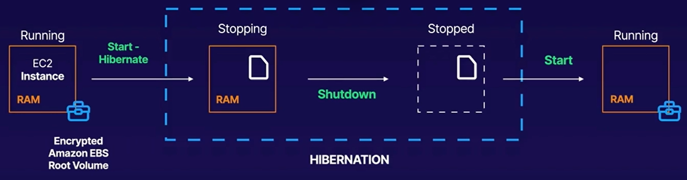
- If an instance is stopped, the data is kept on the disk (with EBS)
- If an instance is terminated, then by default the root device volume will also be terminated
- In Hibernation:
  - OS is told to perform hibernation (suspend-to-disk)
  - Saves the contents from the instance memory (RAM) to your Amazon EBS root volume
  - The instance's Amazon EBS root volume and any attached Amazon EBS data volumes persist
- When starting instance out of hibernation:
  - Amazon EBS root volume is restored to its previous state
  - RAM contents are reloaded
  - Processes that were previously running on the instance are resumed
  - Previously attached data volumes are reattahced and the instance retains its instance ID
- Limitations:
  - Instance RAM must be less than 150 GB
  - Instance families include C3, C4, C5, M3, M4, M5, R3, R4, and R5
  - Available for Windows, Amazon Linux 2 AMI, and Ubuntu
  - Instances cannot be hibernated for more than 60 days

<br>[top of page](#aws-certified-developer-associate-notes)<br>

# Elastic Load Balancer
### Overview
- Automatically distributes incoming traffic across multiple targets
- Can be done across multiple AZs
- All types can be configured to use health checks
  - Healthy = "InService"
  - Unhealthy = "OutOfService"
  - Unhealthy endpoints will not be used in the load balancing operation
- Deregistration Delay
  - Also known as connection draining
  - Allows Load Balancers to keep existing connections open if the EC2 instances are de-registered or become unhealthy
  - Enables the Load Balancer to complet in-flight requests made to instances that are de-registering or unhelathy
  - You can disable deregistration if you want your load balancer to immediately close connections to the instances that are de-registering or have become unhealty
### Types
- `Application`
  - Operate at layer 7
  - Best for HTTP and HTTPS
  - Support only HTTP and HTTPS
  - Supports use of sticky-sessions, but at the target group level
  - Application-aware
  - Intelligent Load Balancer
  - Can utilize path-based routing
    - Traffic is routed based on the path of the web address
  - HTTPS load balancing
    - You must deploy at least one SSL/TLS server certificate on your load balancer
    - The load balancer uses a server certificate to terminate the frontend connection and then decrypt requests from clients before sending them to the targets
- `Network`
  - Operate at layer 4
  - Millions of requests per second
  - Ultra-low latency
  - Performance Load Balancer
  - Process
    1. A listener checks for connection requests from clients, using the protocol and port you configure
    2. The listener on a Network Load Balancer then forwards the request to the target group
       - There are no rules, unlike with Application Load Balancers
       - Does not perform intelligent based routing
    3. Each target group routes requests to one or more registered targets, such as EC2 instances, using the protocol and port number you specify
  - Supported ports and protocols:
    - Protocols:
      - TCP
      - UDP
      - TLS
      - TCP_UDP
    - Ports:
      - 1-65535
  - Encryption:
    - You can use a TLS listener to offload the work of encryption and decryption to your load balancer so your applications can focus on their business logic
    - If the listener protocol is TLS, you must deploy exactly one SSL server certificate on the listener
- `Classic`
  - Operate at layer 4 / 7
    - Can use:
      - X-Forwarded-For:
        - Allows the viewing of the original IP address of the client
        - Normally, without X-Forwarded-For, When traffic is sent from a load balancer, the server access logs contain the IP address of the proxy or load balancer only
      - Sticky sessions
        - Allows you to bind a user's session to a specific EC2 instance
        - Ensures all requests from the user during the session are sent to the same instance
  - Load balancer responds with 504 if there is a problem with the application behind the load balancer
  - Legacy load balancer
  - HTTP, HTTPS, and TCP
  - Classic/Test/Dev Load Balancer
- `Gateway`
  - Provides load balancing for third-party virtual appliances like:
    - Firewalls
    - Intrusion detection and prevention systems

<br>[top of page](#aws-certified-developer-associate-notes)<br>


# Route 53
### Overview
- AWS DNS service
- Domain-name levels:
  - Top: The last word in a domain name represents the top-level domain
  - Second: The second word in a domain name is known as a second-level domain
  - Maintained by Internet Assigned Numbers Authority [here](http://www.iana.org/domains/root/db)
- Domain Registrars
  - Authority that can assign domain names directly under one or more top-levl domains
  - These domains are registered with InterNIC, a service of ICANN, which enforces uniqueness of domain names across the internet
  - Examples:
    - domain.com
    - GoDaddy
    - Hoover
    - AWS
    - Namecheap
- Time to Live (TTL)
  - The length of time that a DNS record is cached on either the resolving server or the user's own local PC
  - The lower the TTL, the faster changes to DNS records take to propagate throughout the internet

### Common DNS record types:
- `SOA` (Source of Authority)
  - Name of the server that supplied the data for the zone
  - The administrator of the zone
  - The current version of the data file
  - The default number of seconds for the time-to-live file on resource records
- `NS` (Name Server)
  - Used by top-level domain servers to direct traffic to the content DNS server that contains the authoritative DNS records
- `A` (Address)
  - Used by a computer to translate the name of the domain to an IP address
  - Domain name to IP address conversion
  - Can be used for naked domain names (zone apex records)
- `CNAME` (Canonical name)
  - Used to resolve one domain name to another
  - Cannot be used for naked domain names (zone apex records)
  - You can't have a CNAME for http://acloudguru.com
- `Alias`
  - Used to map resource record sets in your hosted zone to resources that are configured as websites
  - Work like a CNAME record in that you can map one DNS name to another "target" DNS name

### Routing policies available with route 53
- `Simple`
  - One record
  - Multiple IP addresses
  - Multiple values in a record
  - All values returned in a random order
- `Weighted`
  - Similar to Simple routing policy
  - Allows you to split your traffic based on different weights assigned
- `Failover`
  - Used to create an active / passive setup
  - Route 53 will monitor the health of your primary site using a health check
- `Geolocation`
  - Choose where your traffic will be sent based on the geographic location of your users
- `Geoproximity (traffic flow only)`
  - Only available using Traffic Flow service
  - Route traffic based on the geographic location of your users and your resources
  - Can route more or less traffic to a given resource by specifying a value, known as a bias
- `Latency-based`
  - Route based on lowest network latency for your end user
- `Multivalue Answer`
  - Similar to simple routing
  - Allows you to check the health of each resource, so Route 53 returns only values for healthy resources
  - Best to create one record for each health check

<br>[top of page](#aws-certified-developer-associate-notes)<br>

# AWS CLI Pagination
### Overview
- Control the number of items included in the output when you run a CLI command
- Default page size of 1000
- CLI returns containing more items than the page size will make additional calls

### CLI Pagination-Errors
- Common Errors:
  - If you see errors when running list commands on a large number of resources, the default page size of 1000 might be too high
  - You are most likely to see a "timed out" error, because the API call has exceeded the maximum allowed time to fetch the required results
- Fixing Errors:
  - `--page-size` option can be used to have the CLI request a smaller number of items from each API call
    - Example:
      ```
      aws s3api list-objects --bucket <bucket name> --page-size 100
      ```
  - The CLI still retrieves the full list, but performs a larger number of API calls in the background and retrieves a smaller number of items with each call
  - `--max-items` option can be used to return fewer items in the CLI output
    - Example:
      ```
      aws s3api list-objects --bucket <bucket name> --max-items 100
      ```

<br>[top of page](#aws-certified-developer-associate-notes)<br>


# Relational Database Service (RDS)
### Overview
- Available Database Engines
  - SQLServer
  - Oracle
  - PostrgeSQL
  - MariaDB
  - MySQL
  - Amazon Aurora
- Multi AZ
- Failover capability
- Automated backups
- Generally used for Online Transaction Processing (OLTP)
    - Processing and completing large nubmers of small transactions in real time
  - Online Analytical Processing (OLAP) should be done on Redshift data warehouse
    - Data analysis using large amounts of data
    - Complex queries that take a long time to complete

### Multi-AZ
- These can be multi-az:
  - SQLServer
  - MYSQL
  - MariaDB
  - Oracle
  - PostgreSQL

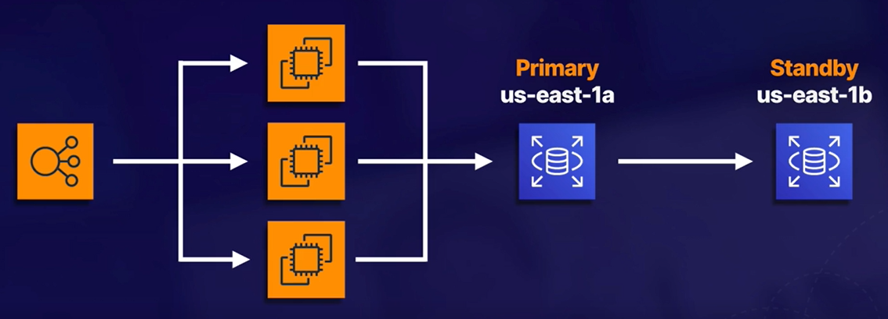

- RDS will automatically fail over to the standby during a failure so database operations can resume quickly

### Read Replicas
- Read only copy of your primary database
- Scales up read performance
- Requires automatic backup
- Multiple read replicas are supported
- Great for read-heavy workloads
- Can be cross AZ
- Can be cross Region
- Each read replica has its own DNS endpoint
- Can be promoted to be their own databases - breaks replication
- Primarily used for scaling, not for Disaster Recovery
- Automatic backups must be enabled in order to deploy a read replica
- All RDS database types support up to 5 read replicas

### RDS Backups
- Types:
  - `Database Snapshot`
    - Manual, ad-hoc, and user-initiated
    - No retention period - exists until you manually delete it
    - Provides a snapshot of the storage volume attached to the DB instance
    - Back up your DB instance in a known state often as you wish, then restore to that specific state at any time
  - `Automated Backup`
    - Enabled by default
    - Stored in S3 - Free storage space equivalent to the size of your database
    - Creates daily backups or snapshots that run during a backup window that you define
    - Transaction logs are used to replay transactions
    - Recover your database to any point in time within a "retention period" of 1-35 days
    - Full daily backup, or snapshot, and transaction logs throughout the day
    - Recovery process
      1. AWS first chooses the most recent daily backup
      2. Applies transaction logs relevant to that day, up to the recovery point
    - I/O may be suspended for a few seconds while the backup process initializes during the backup window
- All restored versions of the DB will always be a new RDS instance with a new DNS endpoint

### Encryption
- Enable at creation time by selecting the encryption option in the console
- Uses AWS Key Management Service (KMS)
- AES-256 encryption
- Includes all DB storage:
  - Underlying storage
  - Automated backups
  - Snapshots
  - Logs
  - Read replicas
- You can't enable encryption on an unencrypted RDS DB instance
- Steps to create encrypted DB from an unencrypted DB
  1. Make an unencrypted snapshot of and unencrypted DB
  2. Make an encrypted snapshot copy of the unencrypted snapshot
  3. Perform a database restore using the encrypted snapshot

<br>[top of page](#aws-certified-developer-associate-notes)<br>


# Amazon Aurora

### Overview
- A MySQL and PostgreSQL-compatible relational database enging
- Combines the speed and availability of high-end commercial databases with the simplicity and cost-effectiveness of open-source databases

### Offerings
- Starts with 10GB
- Scales in 10-GB increments to 128 TB (storage auto scaling)
- Compute resources can scale up to 96 vCPUs and 768 GB of memory
- Deployment of your database
  - 2 copies of your data are contained in each AZ
  - Minimum of 3 zones
  - 6 copies of your data

### Replicas
  - Aurora: you can have 15
  - Aurora MySQL: you can have 5
  - Aurora PostgreSQL: you can have 5
  - Automated failover is only available with Aurora replicas

### Performance
- 5X better than MySQL
- 3X better than PostgreSQL

### Backups
- Always enabled on Amazon Aurora DB instances
- Do not impact performance
- Can also take snapshots - does not impact performance
- Can share snapshots with other AWS accounts

### Serverless
- On-demand
  - Automatically starts up, shuts down
- Auto-scaling
  - Automatically scales up or down
- Only pay for it when you are using it
- Use cases
  - Infrequent, itermittent, or unpredictable workloads

<br>[top of page](#aws-certified-developer-associate-notes)<br>


# Amazon Dynamo DB
### Overview
- Fast and flexible NoSQL database
- Fully managed
- Supported data models:
  - Document
  - Key-value
- Good for mobile, web, gaming, ad-tech, IoT, etc...
- Single-digit millisecond latency

### Tech specs
- Stored on SSD storage
- Spread across 3 geographically distinct data centers
- Consistency model options:
  - Eventual consistent reads (default)
    - Best for read performance
    - Consistency usually reached across all copies of data in about 1 second
  - Strongly consistent reads
    - Best for read consistency
    - Always reflects all successful writes
    - Writes are reflected across all 3 locations at once

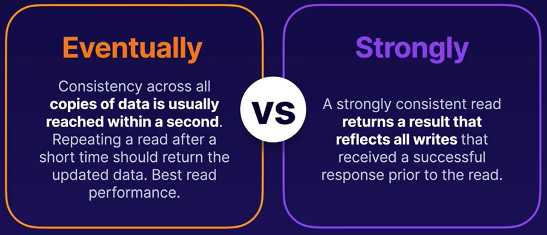

### Primary Keys
- What DynamoDB uses to retrieve data with
- Two types:
  - `Partition key`
    - Based on a unique attribute (customer id, product id, etc...)
    - Partition key value is input to an internal hash function which determines the partition or physical location on which the data is stored
  - `Composite key` (partition key + sort key)
    - Used when multiple entries are in a table for the same partition key
    - In this case, the sort key is used to distinguish the desired table entry

### DynamoDB Accelerator (DAX)
- Fully managed, highly available, in-memory cache
- 10X read performance improvement
- Reduces request times from milliseconds to microseconds - even under load
- No need for developers to manage caching logic
- Compatible with DynamoDB API calls
- Ideal for read-heavy and bursty workloads
- Write-through caching service:
  - Data is written to the cache and the backend store at the same time
  - Allows you to point your DynamoDB API calls at the DAX cluster
  - If the item you are querying is in the cache, DAX returns the result
- Not suitable for applications that:
  - Require strongly consistent reads
  - Are mainly write-intensive
  - Do not perform many read operations
  - Do not require microsecond response times

### Security
- Encrypted at rest using KMS
- Site-to-site VPN
- Direct Connect (DX)
- IAM policies and roles
- Fine-grained access
- Integrates with CloudWatch and CloudTrail
- VPC endpoints

### Access control
- Fine-grained access control with IAM
- IAM condition parameter:
  - `dynamodb:LeadingKeys` allows users to access only the items where the partition key value matches their User_ID

### Flexible Querying
- A query based on an attribute that is not the primary key
- Allows you to run a query on non-primary key attributes using:
  - Global secondary indexes
  - Local secondary indexes
- Allows you to perform fast queries on specific columns in a table
- You select the columns that you want included in the index and run your searches on the index, rather than on the entire dataset

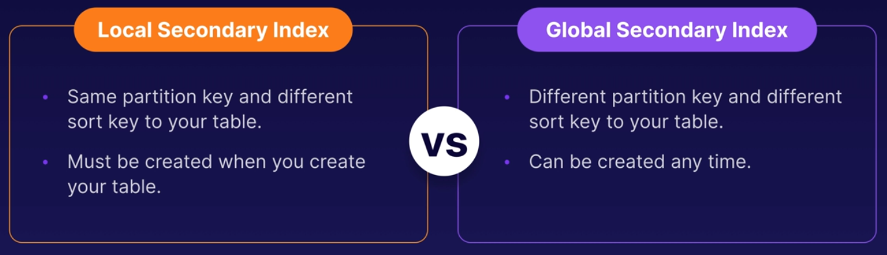

### DynamoDB Transactions
- DynamoDB transactions provide developers ACID across 1 or more tables within a single AWS account and region
- Up to 25 items or 4 MB of data
- ACID basically means all or nothing transactions (atomicity, consistency, isolation, and durability)

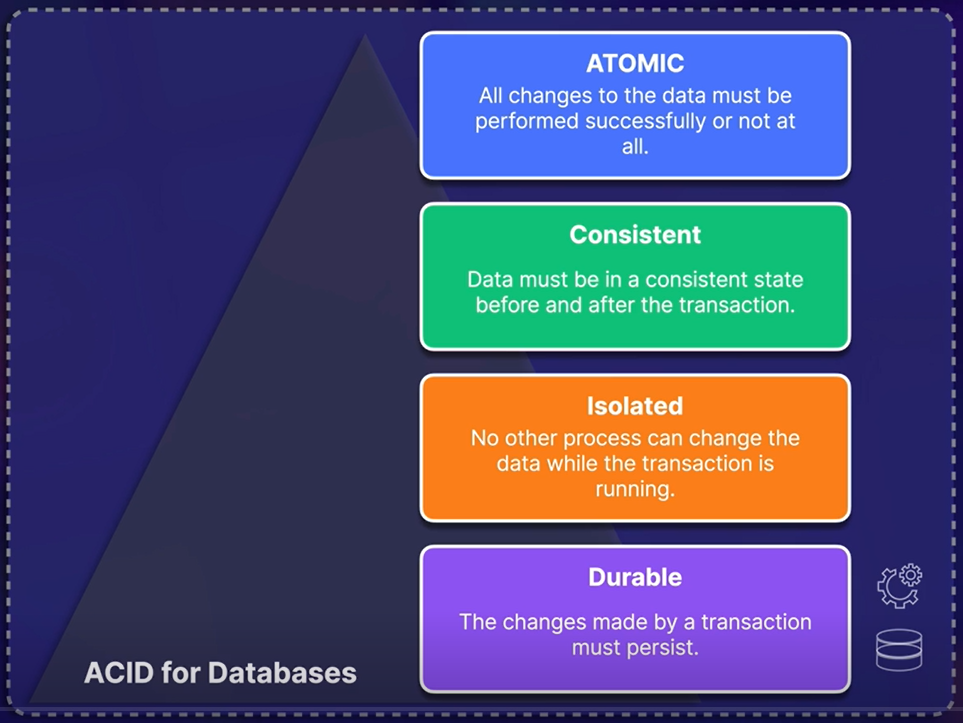

- Read options:
  - Eventual consistency
  - Strong consistency
  - Transactional

- Write options:
  - Standard
  - Transactional

- Use for:
  - Processing financial transactions
  - Fulfilling and managing orders
  - Building multiplayer game engines
  - Coordinating actions across distributed components and services

### On-Demand Capacity Pricing
- Pay-per-request pricing
- Best for unpredictable application traffic
- No minimum capacity
- Pay more per request than with provisioned capacity
- Use for new product launches

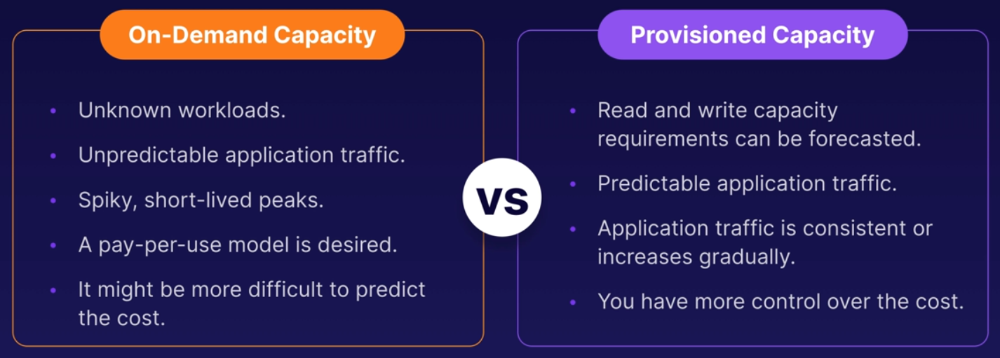

### Provisioned throughput Pricing
- Measured in capacity units:
  - Write:
    - 1 x write capacity unit = 1 x `1KB write per second`
  - Read options:
    - 2 x eventually consistent reads of `4KB per second` (default)
    - 1 x read capacity unit = 1 x strongly consistent read of `4KB per second`
  - If your application reads or writes larger items, it will consume more capacity units and cost you more as well

### Provisioned Throughput Exceeded
- ProvisionedThroughputExceededException
  - Condition where your request rate is too high for the read / write capacity provisioned on your DynamoDB table
- If using the AWS SDK:
  - SDK will automatically retry the requests until successful
  - Uses exponential backoff:
    - Uses progressively longer waits between consecutive retries, for improved flow control
- Not using the AWS SDK:
  - Reduce the number of concurrent requests
  - Reduce your request frequency
  - Uses exponential backoff

### DynamoDB On-Demand Backup and Restore
- Full backups at any time
- Zero impact on table performance or availability
- Consistent within seconds and retained until deleted
- Operates within same region as the source table

### DynamoDB Point-in-Time Recovery (PITR)
- Protects against accidental writes or deletes
- Restore to any point in the last 35 days
- Incremental backups
- Not enabled by default
- Latest restorable: 5 minutes in the past

### DynamoDB Streams
- Time-ordered sequence of item-level changes in a table
- First in first out (FIFO)
- Inserts, updates, and deletes
- Stored for 24 hours
- Encrypted at rest
- Accessed using a dedicated endpoint
- By default, the primary key is recorded
- Use cases:
  - Audit or archive transactions
  - Trigger an event based on a particular transaction
  - Replicate data across multiple tables

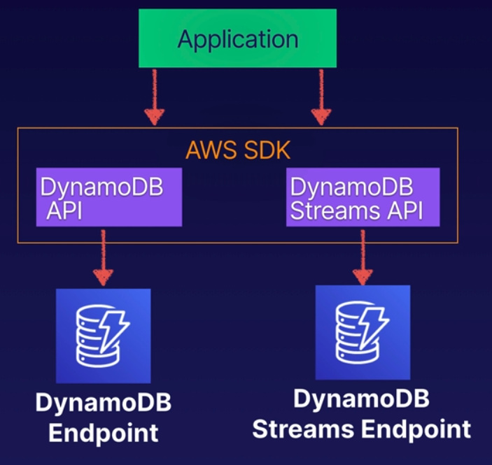
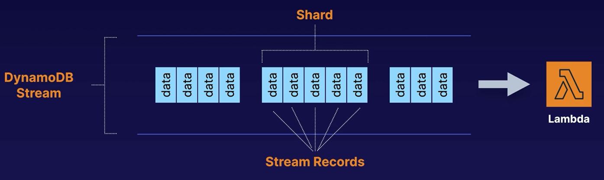

### DynamoDB Global Tables
- Managed multi-master, multi-region replication
- Globally distributed applications
- Based on DynamoDB streams
- Multi-region redundancy for disaster recovery or HA
- Replication latency under 1 second
- No application rewrites
- Table replicants must be deleted before the origional table can be deleted

### Query vs Scan
- Query:
  - Finds items in a table based on the primary key attribute and a distinct value to search for
  - Use an optional sort key name and value to refine the results
  - By default, a query returns all the attributes for the items you select
  - ProjectionExpression: parameter if you want to only return the specific attributes you want
  - Results are always sorted by the sort key
  - Ordered in ascending numeric order by default
  - ScanIndexForward: reverses the order when set to false
  - Eventually consistent by default
  - Need to set a value to be strongly consistent
  - More efficient than a scan, because a scan returns every item in the table and then filters those items
- Scan:
  - Examines every item in the table and returns all data attributes by default
  - ProjectionExpression: parameter if you want to only return the specific attributes you want
  - Avoid using scans
  - Use Query, Get, or BatchGetItem APIs
- Improve performance:
  - Set a smaller page size
    - Will result in a larger number of smaller operations
    - Allows other requests to succeed without failing
  - Parallel vs Sequential
    - Scan operation processes data sequentially by default - Scans one partition at a time
    - Can be configured to use parallel scanning by logically dividing a table into segments and scanning each segment in parallel
    - Avoid parallel scans if your table or index is already incurring heavy read or write activity from other applications
  - Isolate the scan operations to specific tables and segregate them from your mission-critical traffic

### Time to Live (TTL)
- Defines an expiration time for your data
- Expired items are marked for deletion and deleted 48 hours later
- Can filter out expired items from your queries and scans
- Expressed in Epoch time
- Great for removing irrelevant or old data
- Reduces the cost of your table by automatically removing data which is no longer relevant

### API Commands
API Call | CLI Command | Usage
--|--|--
CreateTable | create-table | Creates a new table
PutItem | put-item | Adds a new item into a table or replaces an ole item with a new one
GetItem | get-item | Returns a set of attributes for an item with the given primary key
UpdateItem | update-item | Allows you to edit the attributes of an existing item (e.g., add or delete attributes)
UpdateTable | update-table | Used to modify a table
ListTables | list-tables | Returns a list of tables in your account
DescribeTable | describe-table | Returns information about the table
Scan | scan | Reads every item in a table and returns all items and attributes
Query | query | Queries the table based on a partition key value that you provide
DeleteItem | delete-item | Allows you to delete an item based on its primary key
DeleteTable | delete-table | Deletes a table including all of its items
- The CLI commands are making calls to a DynamoDB API
- User must have the correct IAM permissions to run the commands


<br>[top of page](#aws-certified-developer-associate-notes)<br>


# Elasticache
- In-Memory Cache (key value):
  - Makes it easy to deploy, operate, and scale an in-memory cache in the cloud
- Improves DB performance:
  - Allows you to retrieve information from fast, in-memory caches instead of slower disk-based storage
- Great for Read-heavy DB workloads
  - Caching the results of I/O intensive DB queries
  - Storing session data for distributed applications
- Types:
  - `Memcached`
    - Great for basic object caching
    - Scales horizontally
    - No persistence
    - No multi-AZ
    - No failover
    - Good if you just want basic caching, and a simple caching model
  - `Redis`
    - More sophisticated solution
    - Includes:
      - Persistence
      - Replication
      - Multi-AZ
      - Failover
    - Supports:
      - Sorting and ranking data
      - Complex data types like lists and hashes

<br>[top of page](#aws-certified-developer-associate-notes)<br>


# Systems Manager Parameter Store
- Centralized storage and management of your secrets and configuration data
- You can store:
  - Passwords
  - Database strings
  - License codes
- Supports plain-text and encryption of your stored secrets
- You can reference your parameters using the parameter name

<br>[top of page](#aws-certified-developer-associate-notes)<br>


# Simple Storage Service (S3)
### Overview
- Object storage
- Unlimited stroage
- Objects up to 5TB in size
- Stored in S3 buckets
- S3 scales automatically with demand.
- Universal namespace
- URL naming convention:
  ```html
  https://bucket-name.s3.Region.amazonaws.com/key-name
  ```
  - Example
    ```html
    https://acloudguru.s3.us-east-1.amazonaws.com/Ralphie.jpg
    ```
- Works off of a key:value store
- Stores a version ID and metadata
- Successful CLI or API uploads will generate an HTTP 200 status code.
- Data is spread across multiple devices and facilities to ensure availabilty and durability
- Availability 99.95 - 99.99
- Durability 99.999999999 (9 decimal places)
- Lifecycle management
  - Rules to automatically transition objects to a cheaper storage tier or delete objects that are no longer required after a set period of time.
### Securing data
- `Server-side encryption`:
  - Can add encryption on a bucket to encrypt all new objects when they are stored in the bucket
- `Access Control Lists` (file level access control):
  - Define which accounts or groups are granted access and the type of access
  - Can be attached to individual objects in a bucket
- `Bucket Policies` (bucket level access control):
  - Specify what actions are allowed or denied
  - Example:
    - Allow user Alice to PUT but not DELETE objects in the bucket)
  - Buckets are private by default:
    - When you create an S3 bucket, it is private by default (including all objects within it)
    - You have to allow public access on both the bucket and its objects in order to make the bucket public
  - JSON Example
    ```json
    {
      "Version":"2012-10-17",
      "Statement":[
        {
          "Sid":"PublicRead",
          "Effect":"Allow",
          "Principal": "*",
          "Action":["s3:GetObject"],
          "Resource":["arn:aws:s3:::mybucket/*"]
        }
      ]
    }
    ```
    > The "Principal" field designates which users this policy is applied to.
### Versioning
- Can have multiple versions of an object within S3
- Once enabled, cannot be removed. can only be suspended.
- Can use MFA for deletion
- Public access policies don't apply to previous versions of objects in S3.
- Deleting an object with version control on, only creates a delete marker, it does not delete the versions of the object.
- To restore files with delete markers, delete the delete markers.
### Storage Classes
- S3 Standard
  - Stored in >= 3 AZ
  - Perfect for frequent access
  - Default storage class
  - Use cases: websites, content distro, mobile and gaming applications, and big data analytics
- S3 Standard-Infrequent Access
  - Low per-GB storage price
  - A per-GB retrieval fee
  - Use cases: long-term storage, backups, and as a data store for disaster recovery files.
- S3 One Zone-Infrequent Access
  - Only in one AZ
  - Costs 20% less than S3-IA
  - Good for non-critical data
  - Minimum storage duration: 30 days
- S3 Intelligent-Tiering
  - Automatically moves your data to the most cost-effective tier based on how frequently you access each object.
  - Optimizes cost
- Glacier:
  - You pay each time you access your data
  - Use only for archiving data
  - Cheap storage
  - Optimized for data that is very infrequently accessed.
  - S3 Glacier Options:
    1. Glacier Instant Retrieval
        - Long-term data archiving
        - Instant retrieval time for your data
    2. Glacier Flexible Retrieval
        - Retrieval in minutes, or up to 12 hours
    3. Glacier Deep Archive
        - Cheapest storage class
        - Standard retrieval time is 12 hours
        - Bulk retrieval time is 48 hours
### Life Cycle Management
- Automates moving your objects between the different storage tiers for cost effectiveness
- Can be used to move different versions of objects to different storage tiers
### Access Logs
- Buckets can be configured to create access logs
- Logs will log all requests made to the S3 bucket
- Logs can be written to another bucket
### Object lock
- Stores objects using a write once, read many (WORM) model.
- Can help prevent objects from being deleted or modified for a fixed amount of time or indefinitely.
- Use to meet reglatory requirements, or add extra layer of protection against object changes and deletions.
- Modes:
  1. Governance
      - Users can't overwrite or delete an object version or alter its lock settings unless they have special permission
  2. Compliance
      - No one (including root) can overwrite or delete the object for the duration of the retention period
- Legal Holds:
  - Prevents an object version from being overwritten or deleted
  - No retention period
  - In effect until legal hold is removed
  - Placed and removed by users with permission: `s3:PuObjectLegalHold`
### Glacier Vault Lock:
- Easily deploy and enforce compliance controls for individual S3 Glacier vaults
- Once locked, the policy can no longer be changed.
### Encryption
- Types:
  - In transit:
    - SSL/TLS
    - HTTPS
  - At rest: Server-side encryption
    - SSE-S3: S3-managed keys, using AES 256-bit encryption
    - SSE-KMS: AWS Key Management Service-managed keys
      - Includes:
        - Envelope key which is used to encrypt the object keys
        - Audit trail to show when your keys were used
    - SSE-C: Customer-provided keys
  - At rest: Client-side encryption
    - You encrypt the files yourself before you upload them to S3.
- Can enforce server-side encryption through:
  - Console: select the encryption setting on your S3 bucket
  - Bucket Policy
  - Encrypt files at upload time
    - x-amz-server-side-encryption parameter:
      - Will be included in the PUT request header
      - Tells S3 to encrypt the object at the time of upload, using the specified encryption method
      - You can create a Bucket Policy that denies any S3 PUT that doesn't include this parameter in the header request
    - Types:
      - `x-amz-server-side-encryption: AES256`
        - SSE-S3 - S3 managed keys
      - `x-amz-server-side-encryption: aws:kms`
        - SSE-KMS - KMS managed keys
- Encryption in Transit
  - Can create a bucket policy that requires encryption of data in transit (HTTPS/SSL)
  - Policy explicitly denies any requests that do not use `aws:SecureTransport`
  - S3 will only serve content over HTTPS/SSL and deny all unencrypted HTTP access
  - Policy example:
    ```json
    {
      "Id": "ExamplePolicy",
      "Version": "2012-10-17",
      "Statement": [
        {
          "Sid": "AllowSSLRequestsOnly",
          "Action": "s3:*",
          "Effect": "Deny",
          "Resource": [
            "arn:aws:s3:::<your_bucket_name>/*"
          ],
          "Condition": {
            "Bool": {
                "aws:SecureTransport": "false"
            }
          },
          "Principal": "*"
        }
      ]
    }
    ```
### S3 Prefixes:
- The folders inside a bucket
- Does not include the object and file type
### S3 performance
- First byte out within 100-200 milliseconds
- Requests per second per prefix:
  - 3500 PUT/COPY/POST/DELETE
  - 5500 GET/HEAD
- KMS request rates:
  - Region-specific, however, it's either 5.5k, 10k, or 30k requests per second
  - Up/down loading counts towards KMS quota
  - Currently cannot request a quota increase
- Multipart uploads
  - Parallelize uploads
  - Recommended for files over 100 MB
  - Required for files over 5 GB
- S3 Byte-range fetches
  - Parallelize downloads by specifying byte ranges
- S3 Replication
- You can replicate objects from one bucket to another
- Versioning must be enabled on both the source and destination buckets
- Objects in an existing bucket are not replicated automatically
- Once replication is turned on, all subsequent updated objects will be replicated automatically
- Delete markers are not replicated by default, but can be if configured as such

### Cross Origin Resources Sharing (CORS)
- Allows code in one S3 bucket to access code in another S3 bucket

<br>[top of page](#aws-certified-developer-associate-notes)<br>


# CloudFront

### Overview
- External cache
- Only option to add HTTPS to a static website hosted in an S3 bucket
- Content delivery network (CDN) that securely delivers data, videos, applications, and APIs to customers globally
- It helps reduce latency and provides higher transfer speeds using AWS edge locations
- Works for both AWS and on site architectures
- Objects refresh based on a configured time-to-live (TTL)
  - Default is 24 hours
### Security
  - Defaults to HTTPS connections with the ability to add custom SSL certificate
### Global distribution
  - You can't pick specific countries - just general areas of the globe
  - Can restrict specific countries
  - It can be used to block individual countries, but the WAF is a better tool for it
### Endpoint support
  - Can be used to from AWS endpoints along with non-AWS applications
### Expiring content:
  - You can force an expiration of content from the cache if you can't wait for the TTL
  - Will cost money
### Origin Access Identity
  - A special cloudfront user that can access the files in a bucket and serve them to users
  - Can be used to serve S3 files that are in buckets with bucket policies that restrict public access
  - Forces users to use the CloudFront URL instead of a direct S3 URL
### Allowed Methods
  - HTTP methods (GET,PUT,POST,ect...) that your cloudfront distribution is going to support
  - You choose the methods in the cloudfront distribution setup
  - Current options:
    - Read only options
      - GET, HEAD
      - GET, HEAD, OPTIONS
    - Read and write option
      - GET, HEAD, OPTIONS, PUT, POST, PATCH, DELETE

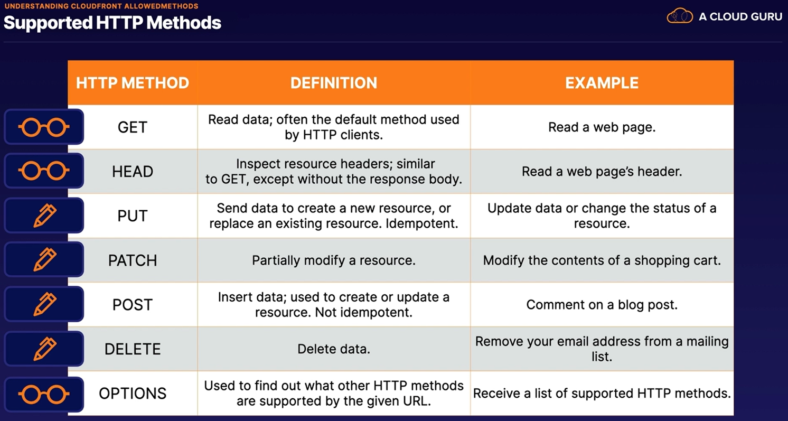

<br>[top of page](#aws-certified-developer-associate-notes)<br>


# Serverless Solutions
- Enables you to build scalable applications quickly without managing any servers
- Are event-driven and you are only charged when your code is executed
- AWS handles all the heavy lifting while you focus on writing code and building your application

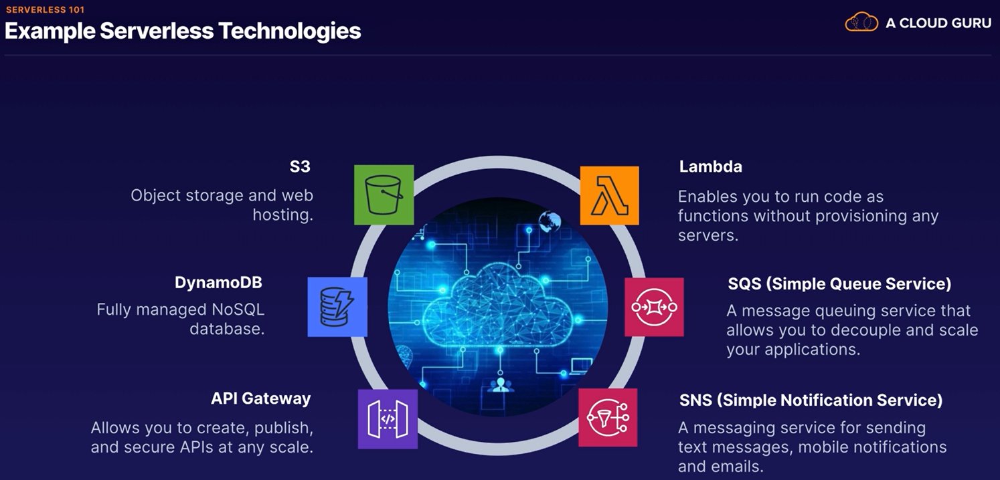

<br>[top of page](#aws-certified-developer-associate-notes)<br>

# Lambda
### Overview
- Scales automatically
- Pay only wher your code executes
- Serverless
- Event driven architecture
- Can be triggered by:
  - AWS services such as:
    - DynamoDB
    - Kinesis
    - SQS
    - Application Load Balancer
    - API Gateway
    - Alexa
    - Cloudfront
    - S3
    - SNS
    - SES
    - CloudFormation
    - CloudWatch
    - CodeCommit
    - CodePipeline
    - And more...
  - Directly from any web or mobile app
- 15 minute maximum runtime

### Building a function
- Runtime: The environment that your code will run in.
- Permissions: If your lambda function needs to make an AWS API call, you'll need to attach a role
- Networking: You can (optionally) define the VPC, subnet, and security groups your functions are a part of
- Resources: Defining the amount of available memory will allocate how much CPU and RAM your code gets
- Trigger: What's going to alert your Lambda function to start? Defining a trigger will kick Lambda off if that event occurs

### Pricing
- First 1 million request per month are free
- First 400,000 GB-seconds per month are free
- $0.20 per month per 1 million requests
- Duration:
  - Charged in millisecond increments
  - Price depends on the amount of memor you allocate to your Lambda function
  - $0.00001667 pre GB-second
- Example:
  - A function that uses 512MB and runs for 100ms:
    ```
    0.5GB x 0.1s = 0.05 GB-seconds
    0.05 x 0.00001667 = $0.0000008335

    The lambda function costs $0.0000008335 each time it is run.
    ```

### Lambda Versions
- `$LATEST` is always the last version of code you uploaded to Lambda
- Use Lambda Versioning and Aliases to point your applications to a specific version if you don't want to use `$LATEST`
- Example:
  ```
  arn:aws:lambda:eu-west-2:738450006354:function:mylambda:Prod
  arn:aws:lambda:eu-west-2:738450006354:function:mylambda:$LATEST
  ```
- If your application uses an alias, instead of `$LATEST` remember that it will not automatically use new code when you upload it

### Concurrent Execution Limit
- Safety feature to limit the number of concurrent executions across all functions in a given region per account
- Default is 1,000 per region
- If limit is reached:
  - TooManyRequestsException message
  - HTTP Status Code: 429
- Can request limit increase through the console
- Can set a reserved concurrency:
  - Guarantees that set number of executions which will always be available for your critical function, however this also acts as a limit

### Lambda VPC Access
- Cannot connect to a VPC by default
- You must allow the function to connect to the private subnet
- Lambda needs the following VPC configuration information so that it can connect to the VPC:
  1. Private subnet ID
  2. Security group ID (with required access)
  > Lambda uses this information to set up ENIs using an available IP address from your private subnet
- You add VPC information to your Lambda function config using the vpc-config parameter:
  ```
  aws lambda update-function-configuration --function-name my-function --vpc-config SubnetIds=<your_subnet_ID>,SecurityGroupIDs=<your_security_group_id>
  ```

<br>[top of page](#aws-certified-developer-associate-notes)<br>


# Step Functions
### Overview
- Provide a visual interface for serverless applications
- Enables you to build, and run serverless applications as a series of steps
- Each step in your application executes in order, as defined by your business logic
- Each step is executed by a seperate Lambda function
- The output of one step may act as the input to the next step
- Logs the state of each step, so when things go wrong, you can diagnose and debug problems quickly
- Manages the logic of your application through:
  - Sequencing
  - Error Handling
  - Retry logic
- Entire process is a state machine
- State machines are defined using Amazon States Language

### Workflows
- Types:
  - `Standard`
    - Long-running
      - Durable, and auditable
      - Run up to one year
      - Full execution history available for up to one year
    - At-Most-Once Model
      - Tasks are never executed more than once unless you explicitly specify retry actions
    - Non-Idempotent Actions
      - When processing payments, you only want a payment to be processed once, not multiple times
      - A request is non-idempotent if it always causes a change in state
  - `Express`
    - Short-lived
      - Good for high-volume, event-processing-type workloads
      - Up to 5 minutes
    - At-Least-Once
      - Ideal if:
        - There is a possibility that an execution might be run more than once 
        - You require multiple concurrent executions
    - Idempotent actions
      - An identical request can be made once or several times in a row with no additional side effects
    - Types of Express workflows:
      - `Synchronous`
        - Begins a workflow
        - Waits until it completes
        - Returns the results
      - `Asynchronous`
        - Begins the workflow
        - Confirms the workflow has started
        - The results of the workflow can be found in CloudWatch Logs
- Types of workflow processing:
  - Sequential
  - Parallel
  - Branching

<br>[top of page](#aws-certified-developer-associate-notes)<br>


# API Gateway
### Overview
- Fully managed API service that makes it easy for developers to work with APIs to:
  - Create
  - Publish
  - Maintain
  - Monitor
- Types
  - `RESTful`
    - Optimized for stateless, serverless workloads
  - `Websocket`
    - For real-time, two-way, stateful communications
    - e.g. chat ops
- Serverless
- Sends log events to cloudwatch for:
  - API calls
  - Latencies
  - Error rates
- Helps you manage traffic spikes with throttling so that backend operations can withstand traffic spikes and DoS attacks
- Allows you to connect to:
  - Applications running on Lambda, EC2, or Elastic Beanstalk
  - Services like DynamoDB and Kinesis
- Allows you to:
  - Protect your endpoints by attaching a Web Application Firewall (WAF)
  - Implement DDOS protection and rate limiting to curb abuse of their endpoints
- Supports multiple versions which allows you to have versions for development, testing, and production
- Supports multiple endpoints and targets which lets you send each API endpoint to a different target

### Importing APIs into API gateway
- Importing API definition files:
  - You can use the API Gateway Import API feature to import an API using a definition file
- OpenAPI, formerly known as Swagger, is supported
- Create new and update existing APIs
  - You can use an OpenAPI definition file to create a new API or update an existing API

### Caching
- Caches your endpoints responses
- Cached responses are kept for a specified time-to-live (TTL) period in seconds (default = 300)
- New requests first search the cache

### Account Level Throttling
- Prevents your API from being overwhelmed by too many requests
- Default steady-state request rate limit is 10,000 requests per second, per region
- Maximum concurrent requests is 5,000 requests across all APIs per region
- You can request an increase to these limits
- If exceeded, you will receive a "429 Too Many Requests" error message

<br>[top of page](#aws-certified-developer-associate-notes)<br>


# X-Ray
### Overview
- Tool that helps developers analyze and debug distributed applications
- X-Ray Service Map:
  - Provides a visualization of your applications underlying components
  - Provides an end-to-end view of requests as they travel through your application
  - Collects data:
    - Latency
    - HTTP status codes
    - Errors
- Works with:
  1. AWS Services:
    - Elastic Cloud Compute (EC2)
    - Elastic Container Service (ECS)
    - Lambda
    - Elastic Beanstalk
    - Simple Notification Service (SNS)
    - Simple Queue Service (SQS)
    - DynamoDB
    - Elastic Load Balancer
    - API Gateway
  2. Your applications writen in:
    - Java
    - Node.js
    - .NET
    - Go
    - Ruby
    - Python
  3. API Calls
    - X-Ray SDK automatically captures metadata for API calls made to AWS services using the AWS SDK

### Architecture
- Usage
  1. Install the X-Ray agent on your EC2 instance
  2. Configure your application using the X-Ray SDK
  3. Operate X-Ray SDK:
     - X-Ray SDK gathers information from:
       - Requests and response headers
       - Code in your application
       - Metadata about the AWS resources on which it runs
     - X-Ray SDK sends the information to X-Ray:
       - Data such as:
         - HTTP requests
         - Error codes
         - Latency data

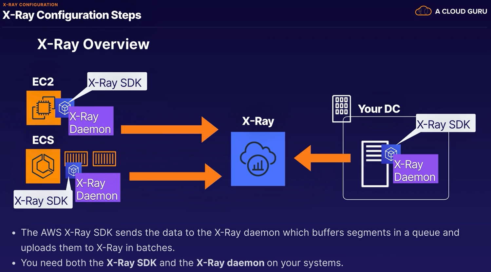

### Configuration Requirements
1. On premises and EC2 instances usage
   - Install the X-Ray daemon on your EC2 instance or on-premises server
2. Elastic Beanstalk usage
   - Install the X-Ray daemon on the EC2 instances inside your Elastic Beanstalk environment
3. Elastic Container Service
   - Install the X-Ray daemon in its own Docker container on your ECS cluster alongside your app

### Annotations and Indexing
- Allows you to record additional information about requests
- Simple key-value pairs that are indexed for use with filter expressions
- Allows you to search for traces that contain specific data and group related traces together in the console

<br>[top of page](#aws-certified-developer-associate-notes)<br>


# Key Management Service (KMS)
### Overview
- Managed service that makes it easy for you to create and control the encryption keys used to encrypt your data
- Region based
- Integrates with:
  - S3
  - RDS
  - DynamoDB
  - Lambda
  - EBS
  - EFS
  - CloudTrail
  - Developer Tools
### Customer Master Key (CMK)
- Logical representation of a master key
- Key states:
  - Enabled
  - Disabled
  - Pending
  - Deletion
  - Unavailable
- Includes metadata, such as the key ID, creation date, description, and key state
- Capable of encrypting and decrypting up to 4KB
- Ways to generate:
  1. AWS creates it within a HSM managed by AWS
  2. Import key material from your own key management infrastructure and associate it with a CMK
  3. Have the key material generated and used in an AWS CloudHSM cluster as part of the custom key store feature in AWS KMS
- Key policies:
  - Resource-based policies attached to your CMKs
  - All KMS CMKs have a key policy
### Envelope encryption:
- CMK is used to generate, encrypt, and decrypt the Data Key
- Data key is then used to encrypt, and decrypt your data
- Why Envelope Encryption?
  1. If you encrypt data directly with KMS (instead of using the data key) it must be transferred over the network
  2. With envelope encryption, only the data key goes over the network, not your data
  3. The data key is used locally in your application tor AWS service, avoiding the need to transfer large amounts of data to KMS
### Automatic key rotation:
- If your keys were generated within AWS KMS HSMs, you can have AWS KMS automatically rotate CMKs every year
- Not supported for:
  - Imported keys
  - Asymmetric keys
  - Keys generated in an AWS CloudHSM cluster using the AWS KMS custom key store feature
### Policies:
- Identity-based: attached to an IAM identity
- Resource-based: attached to other kinds of resources
### Ways to control permissions:
1. Use the key policy
   - The full scope of access to the CMK is defined in a single document
2. Use IAM policies in combination with the key policy
   - Enables you to manage all the permissions for your IAM identities in IAM
3. Use grants in combination with the key policy
   - Enables you to allow access to the CMK in the key policy
   - Can allow users to delegate their access to others

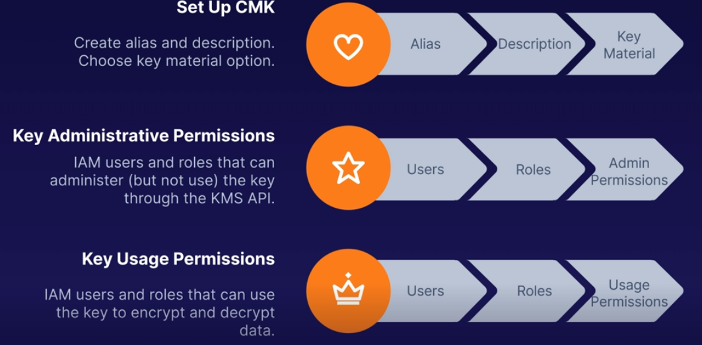

### KMS API Calls
Command | Description
--|--
aws kms encrypt | Encrypts plaintext into ciphertext using a customer master key
aws kms decrypt | Decrypts ciphertext that was encrypted by a CMK
aws kms re-encrypt | Decrypts ciphertext then re-encrypts it within KMS
aws kms enable-key-rotation | Enables automatic key rotation every 365 days
aws kms generate-data-key | Uses the CMK to generate a data key to encrypt data > 4 KB

<br>[top of page](#aws-certified-developer-associate-notes)<br>


# Simple Queue Service (SQS)
### Overview
- Fully managed message queuing service
- Enables you to decouple and scale microservices, distributed systems, and serverless applications
- Uses pull-based messaging:
  - Allows asynchronous processing of work
  - One resource will write a message to an SQS queue, and then another resource will retrieve that message from SQS
- Acts as the component receiving the data for processing, and the component producing and saving the data
- For large SQS messages (256KB up to 2GB), you can store them in S3
### SQS settings:
  1. Delivery Delay
     - Default is 0
     - Can be set up to 15 min.
  2. Message Size:
     - Up to 256 KB
     - Text in any format
  3. Encryption:
     - Messages are encrypted in transit by default
     - Can add at-rest
  4. Message Retention:
     - Default is 4 days
     - Can be set between 1 minute and 14 days
  5. Long vs. Short
     - Short:
       - Returns a response immediately even if the message queue being polled is empty
       - Can result in a lot of empty responses if nothing is in the queue
       - You will still pay for these responses
     - Long:
       - Periodically polls the queue
       - Doesn't return a response until a message arrives in the message queue or the long pole times out
       - Long means that you wait for data
       - Long is not the default
       - Long is cheaper
       - Long uses fewer CPU cycles
       - Generally preferable to short polling
  6. Queue Depth
     - This can be a trigger for autoscaling
### Visability Timeout
- Amount of time that the SQS service will lock a message that is being processed by another service
- Default is 30 seconds
- Maximum is 12 hours
- If the timeout expires, the message will re-appear in the queue
### Dead-Letter Queues
- A queue to hold messages that are problemattic
- Messages in the SQS that reach a maximum retry count are moved to the dead-letter queue
- It is just an SQS queue that is set to receive the reject messages
- Messages will be held up to 14 days
- Usable with simple notification service
### Simple (standard) SQS
- Nearly-unlimited number of transactions per second
- Guarantees that a message is delivered at least once
- Provides best-effort ordering which ensures that messages are generally delivered in the same order as they are sent
- Occasionally, more than one copy of a message might be delivered out of order
### FIFO (first in first out) SQS
- Guaranteed ordering of messages
- No message duplication
- 300 messages per second
- Does not have the same performance as simple SQS
- Message groups may be out of order, but the messages in those groups are in order
- Costs more than simple SQS

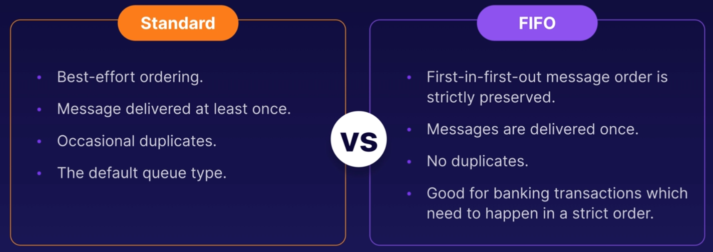

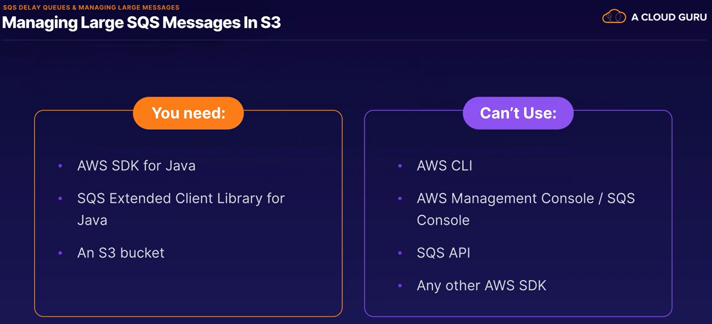

<br>[top of page](#aws-certified-developer-associate-notes)<br>


# Simple Notification Service (SNS)
### Overview
- Fully managed messaging service for:
  - Application-to-application (A2A)
  - Application-to-person (A2P)
- All messages are stored redundantly across multiple AZ
- SNS will only retry HTTP(S) endpoints, but nothing else
- Push-based messaging
  - Proactively delovers messages to the endpoints subscribed to it
- Endpoints examples:
  - Devices
  - SMS text messages
  - E-mail
  - Any HTTP endpoint
  - Lambda

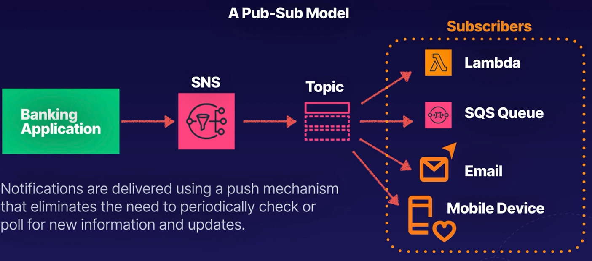

### Settings:
- Subscribers:
  - Kinesis Data Firehose
  - SQS
  - Lambda
  - E-mail
  - HTTP(S)
  - SMS
  - Platform application endpoint
- Message size up to 256 KB
- DLQ support:
  - Messages that fail to be delivered can be stored in an SQS DLQ
- FIFO or Standard:
  - FIFO only supports SQS as a subscriber
- Encryption:
  - Messages are encrypted in transit by default
  - You can add at-rest encryption
- Access Policy:
  - A resource policy can be added to a topic, similar to S3

<br>[top of page](#aws-certified-developer-associate-notes)<br>


# Simple Email Service (SES)
- Designed to help marketing teams and application developers send marketing, notification, and transactional emails to their customers using a pay-as-you-go model
- Can also be used to receive emails with incoming mails delivered to an S3 bucket
- Incoming emails can be used to trigger Lambda functions and SNS notifications
- Use to:
  - Send automated emails
  - Purchase confirmations, shipping notifications, and order status updates
  - Automated marketing communications
- Supports Fanout
  - Can send messages to a large number of recipients through multiple SQS queues, HTTP endpoints, and email addresses

<br>[top of page](#aws-certified-developer-associate-notes)<br>


# Kinesis
### Overview
- Allows you to collect, process, and analyze real-time streaming data in real-time
- Think of it as a huge data highway connected to your AWS account
- Processes streaming data in small sizes (kilobytes) generated continuously by thousands of data sources such as:
  - Financial transactions
  - Stock prices
  - Game data (as the gamer plays)
  - etc...
- 2 versions available:

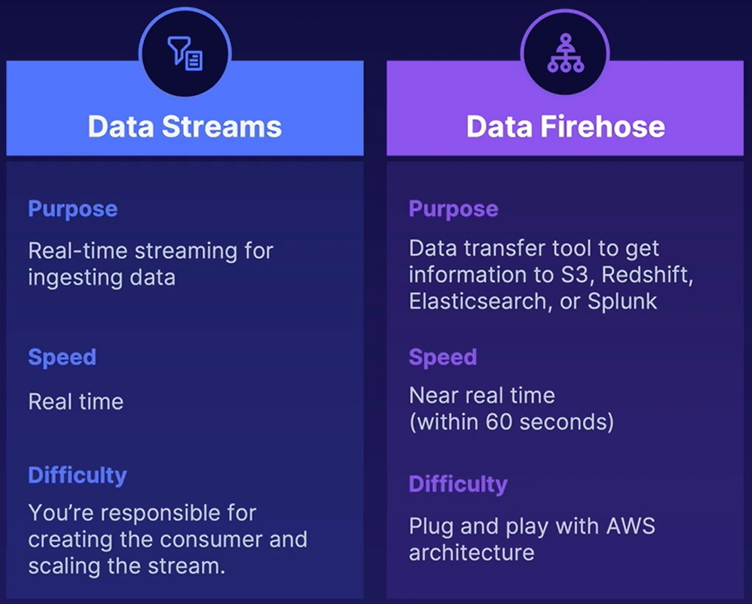

- Analyze Kinesis data using standard SQL
- Fully managed, real-time serverless service
- Automatically handles scaling and provisioning of needed resources
- You only pay for the amount of resources you consume as your data passes through
- Kinesis provides real-time communication and is mostly used in big data applications
- Real-time = Streams
- Near Real-time = Firehose
- Kinesis vs. SQS:
  - Both are message brokers, but only Kinesis is real time
- Transforming data:
  - Data Analytics is the easiest way to process data going through Kinesis using SQL
- Scaling:
  - Data Streams does not automatically scale. Data Firehose does.
### Services
- `Kinesis Streams`
  - Stream data and video to allow you to build custom applications that process data in real-time
  - Made up of shards
  - Data capacity of the stream is determined by the number of shards
  - Two types:
    - Kinesis Data Streams
    - Kinesis Video Streams
      - Securely stream video from connected devices to AWS
  - Shards:
    - Each shard is a sequence of one or more data records and provides a fixed unit of capacity
    - Read and write capacity is on a per-shard basis
    - Multiple shards can be used for a Kinesis stream
    - As your data rate increases, you increase the number of shards (resharding)
    - Reading data
      - 5 reads per second
      - Max read rate is 2 MB per second
    - Writing data
      - 1000 writes per second
      - Max write rate is 1 MB per second

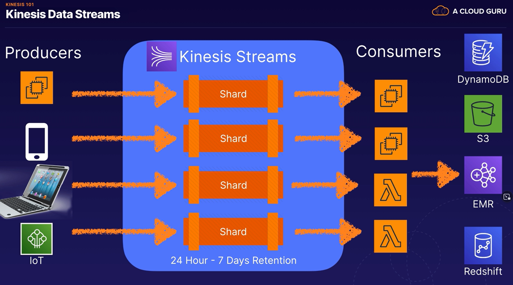

  - `Kinesis Client Libraries (KCL)`
    - Runs on the container instance
    - Tracks the number of shards in your stream
    - Discovers new shards when you reshard
    - The KCL ensures that for every shard there is a record processor
    - Manages the number of record processors relative to the number of shards & consumers
    - If you have only one consumer, the KCL will create all the record processors on a single consumer
    - If you have two consumers it will load balance and create half the processors on one instance and half on another
    - Generally, the number of instances does not need to exceed the number of shards (except for standby purposes)
    - You never need multiple instances to handle the processing load of one shard
    - One worker can process multiple shards
    - CPU utilization is what should drive the quantity of consumer instances you have, not the number of shards in your Kinesis stream
    - Use an auto-scaling group, and base scaling decisions on CPU load on your consumers

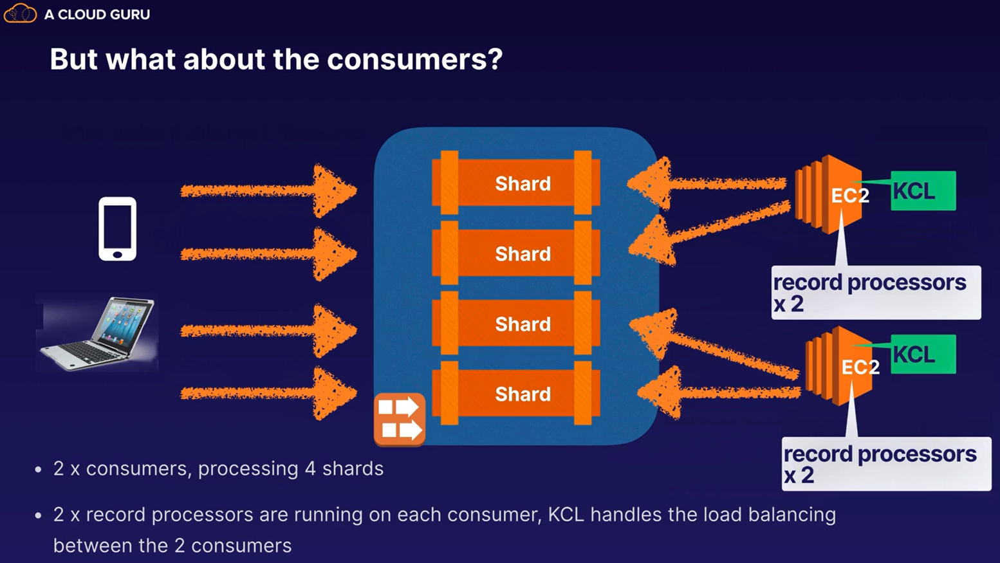

- `Kinesis Data Firehose`
  - Capture, transform, load data into AWS data stores to enable near-real-time analytics with BI tools

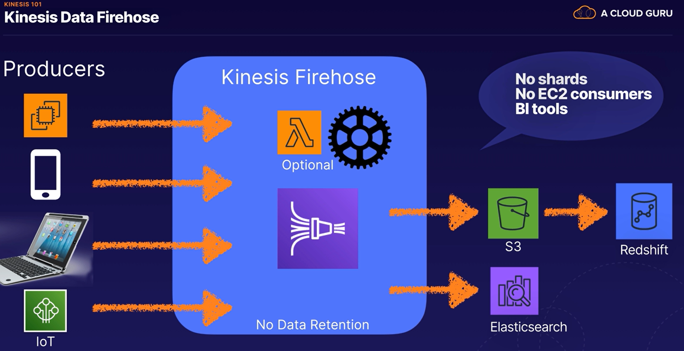

- `Kinesis Data Analytics`
  - Analyze, query, and transform streamed data in real-time using standard SQL
  - Store the results in and AWS data store

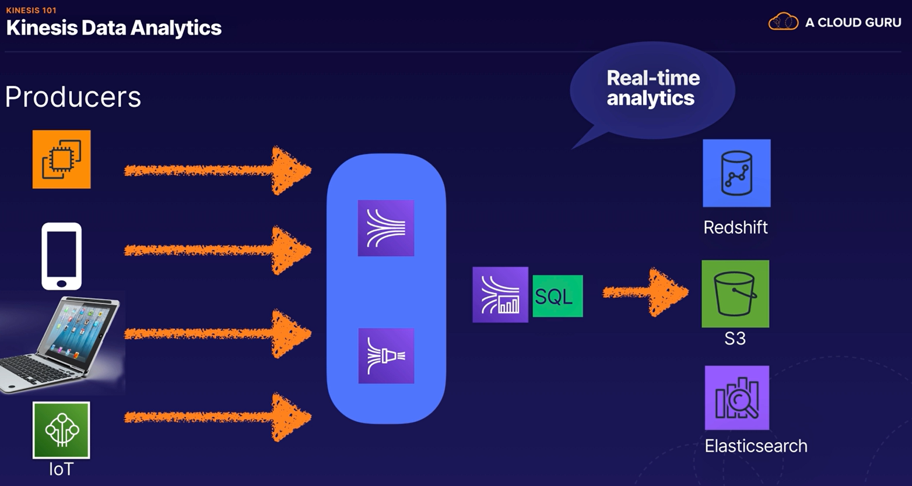

<br>[top of page](#aws-certified-developer-associate-notes)<br>


# Elastic Beanstalk
### Overview
- The Amazon PaaS tool
- Easy-to-use all in one service for deploying and scaling web applications and services developed with a variety of supported languages
- Platform as a Service (PaaS)
  - Is a single-stop application deployment model
  - You bring your code, and the provider builds everything for you, deploys your application, and then manages it going forward
- Supports containers, Windows, and Linux applications
- It's not serverless
- It is creating and managing standard EC2 architecture
- It's a great solution to start with, but in general it's only for simpler web applications
### Usage
- `Automation`
  - Elastic Beanstalk automates all your deployments
  - You can templatize what you'd like your environment to look like
- `Deployment`
  - It will handle all your deployments
  - You can upload your code, test your code in a staging environment, and then deploy to production
- `Management`
  - Will handle building out the insides of your EC2 instances for you
  - You don't have to get on the hosts yourself
### Deployment Updates
- `All at once`
  - Deploys to all hosts concurrently
  - You will experience a total outage
  - Not ideal for mission-critical production systems
- `Rolling`
  - Deploys the new version in batches
  - Each batch is taken out of service while the deployment takes place
  - Your environment capacity will be reduced by the number of instances in a batch while the deployment takes place
  - Not ideal for performance sensitive systems
- `Rolling with additional batch`
  - Launches an additional batch of instances
  - Then deploys the new version in batches
  - Maintains full capacity throughout deployment
- `Immutable`
  - Deploys the new version to a fresh group of instances
  - Only when the new instances pass their health checks, should the old instances be terminated
  - If the deployment fails, just delete the new instances
  - This is the preferred approach for mission critical systems
- `Traffic splitting`
  - Installs the new version on a new set of instances, like an immutable deployment
  - Forwards a percentage of incoming client traffic to the new application version for evaluation
### Advanced Elastic Beanstalk
- Customizing Amazon Linux 2 environments:
  - `Buildfile`
    - For commands that run for short periods and then exit upon task completion (e.g., running a shell script)
    - Root directory:
      - Create your Buildfile in the root directory of you application source
    - Format:
      - Key, value pairs containing a process name and a path to the script that you want to run
      - `<process_name>: <command>`
  - `Procfile`
    - Long-running application processes (e.g., commands to start and run your application)
    - Root directory:
    - Format:
      - Key, value pairs containing a process name and a path to the script that you want to run
      - `<process_name>: <command>`
      - Create your Procfile in the root directory of you application source
    - Elastic Beanstalk expects processes defined in the Procfile to run continuously
    - It monitors and restarts any processes that terminate
  - `Platform Hooks`
    - Custom scripts or executable files that you would like Elastic Beanstalk to run at a chosen stage of the EC2 provisioning process
    - Stored in dedicated directories in your application source code:
      - `.platform/hooks/prebuild`
        - Files that you want Elastic Beanstalk to run before it builds, sets up, and configures the application and web server
      - `.platform/hooks/predeploy`
        - Files that you want to run after it sets up an dconfigures the application and web server but before it deploys them to the final runtime location
      - `.platform/hooks/postdeploy`
        - Files that run after Elastic Beanstalk deploys the application
        - The last deployment workflow step
### RDS with Elastic Beanstalk
- `Deployment Options`
  - `Option 1: Launch RDS within Elastic Beanstalk`
    - Launch the RDS instance from within the Elastic Beanstalk console
    - It is created within your Elastic Beanstalk environment
    - If you terminate the environment, the database will also be terminated
    - It is a good option for Dev and Test deploymnets, not so good for production
  - `Option 2: Launch RDS outside of Elastic Beanstalk`
    - Don't use Elastic Beanstalk to create your RDS database
    - Instead, use the RDS console or AWS CLI
    - It allows you to tear down your application environment without affecting the database instance
    - Connecting to outside databases:
      - An additional Security Group must be added to your environment's Auto Scaling group
      - You'll need to provide connection string information to your application servers using Elastic Beanstalk environment properties
        - Example:
          ```
          mysql-instance1.123456789012.us-east-1.rds.amazonaws.com DB password: xE49ddk2
          ```

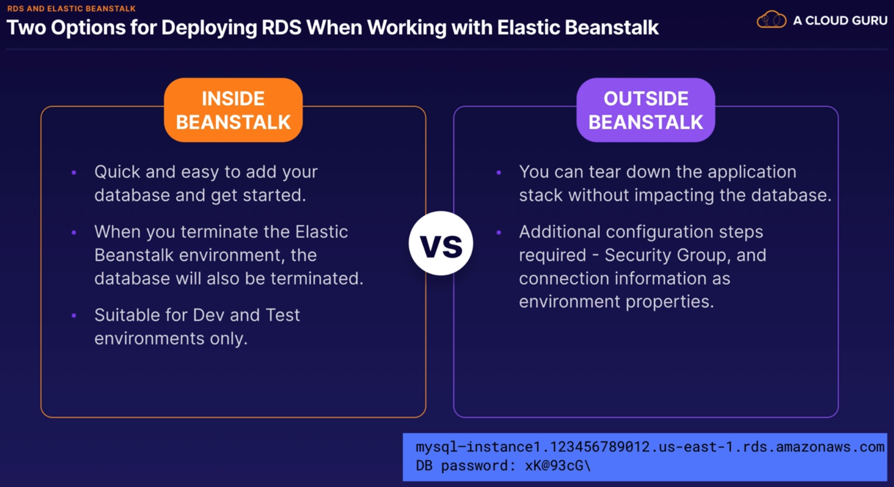

### Migrating applications to Elastic Beanstalk
- `Windows Web Application Migration Assistant`
  - Formerly known as .NET Migration Assistant for Elastic Beanstalk
  - Interactive PowerShell utility
  - Enables you to migrate a .NET application, or entire website from Windows servers in your data center, to Elastic Beanstalk in AWS
  - Application is open source and available on GitHub
  
<br>[top of page](#aws-certified-developer-associate-notes)<br>


# AWS Developer Tools

### Code Commit
- Source and version control
- Enables teams to collaborate on:
  - Code
  - Html
  - Scripts
  - Images
  - Binaries
- Enables collaboration
- Tracks and manages code changes
- Maintains version history

### Code Build
- Automated build
- Compiles source code
- Runs, tests, and produces packages that are ready to deploy

### Code Deploy
- Automated deployment
- Automates code deployments to any instance, including EC2, Lambda, and on-premises
- Deployment approaches
  - `In-Place`
    - The application is stopped on each instance and the new release is installed
    - Also known as a `Rolling Update`
    - Roll-backs are not easy and invole the re-deployment of a previous version which can be time consuming
  - `Blue / Green`
    - Blue represents the active deployment, and green is the new release
    - Steps:
      - New instances are provisioned and the new release is installed on the new instance
      - New instances are registered with the Elastic Load Balancer
      - Traffic is routed away from the old environment
      - Old instances are eventually terminated
    - For roll-back just set the Elastic Load Balancer to direct traffic to the old instances (as long as they still exist)

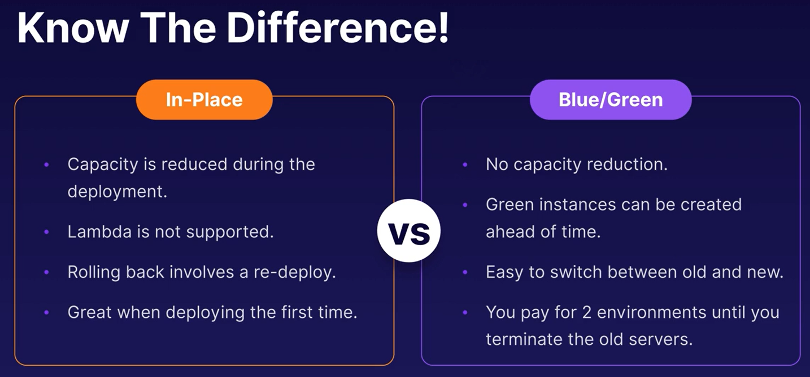

### Codedeploy `AppSpec` file:
- Defines the parameters to be used during a CodeDeploy deployment
- EC2 and on-premises systems: YAML only
- Lambda: YAML and JSON supported
- File structure depends on whether you are deploying to Lambda or EC2
- EC2 AppSpec file structure:
  - `Version`
    - Reserved for future use
    - Currently only the allowed value is 0.0
  - `OS`
    - Operating system version
    - The operating system version you are using, e.g. linux, windows
  - `Files`
    - Configuration files, packages
    - The location of any application files that need to be sopied and where they should be copied to
  - `Hooks`
    - Lifecycle event hooks
    - Scripts which need to run at set points in the deployment llifecycle:
      - Script example actions:
        - Uzip application files prior to deployment
        - Run functional tests on a newly deployed application
        - De-register and re-register instances with a load balancer
    - Hooks have a very specific run order
    - Basic run order:
      - `PHASE 1` - De-registering instances from a load balancer
        - `BeforeBlockTraffic`
          - Tasks you want to run on instances before they are de-registered from a load balancer
        - `BlockTraffic`
          - De-register instances from a load balancer
        - `AfterBlockTraffic`
          - Tasks you want to run on instances after they are de-registered from a load balancer
      - `PHASE 2` - The real nuts and bolts of the application deployment
        - `ApplicationStop`
          - Gracefully stop the application
        - `DownloadBundle`
          - CodeDeploy agent copies the application revision files to a temprary location
        - `BeforeInstall`
          - Pre-installation scripts, e.g. backing up the current version, decrypting files
        - `Install`
          - Copy application revision files to final location
        - `AfterInstall`
          - Post-install scripts e.g. configuration, file permissions
        - `ApplicationStart`
          - Start any services that were stopped during ApplicationStop
        - `ValidateService`
          - Run tests to validate the service
      - `PHASE 3` - Re-registering instances with a load balancer
        - `BeforeAllowTraffic`
          - Tasks you want to run on instances before they are registered with the load balancer
        - `Allow`
          - Register instances with a load balancer
        - `AfterAllowTraffic`
          - Tasks you want to run on instances after they are registered with a load balancer
      
- Example appspec.yml file:
  ```
  version: 0.0
  os: linux
  files:
    - source: Config/config.txt
      destination: /webapps/Config
    - source: Source
      destination: /webapps/myApp
  hooks:
    BeforeInstall:
      - location: Scripts/UnzipResourceBundle.sh
      - location: Scripts/UnzipDataBundle.sh
    AfterInstall:
      - location: Scripts/RunResourceTests.sh
        timeout: 180
    ApplicationStart:
      - location: Scripts/RunFunctionalTests.sh
        timeout: 3600
    ValidateService:
      - location: Scripts/MonitorService.sh
        timeout: 3600
        runas: codedeployuser
  ```
- Typical folder setup:
  ```
  appspec.yml
  /Scripts
  /Config
  /Source
  ```
  > The appspec.yml must be placed in the root of the directory of your Revision, otherwise the deployment will fail


### Code Pipeline
- Manages the workflow
- End-to-end solution
- Build, test, and deploy your application every time there is a code change
- Enables quick release of new features and bug fixes
- Integrates with AWS and third-party tools:
  - CodeCommit
  - CodeBuild
  - CodeDeploy
  - Github
  - Jenkins
  - Elastic Beanstalk
  - CloudFormation
  - Lambda
  - Elastic Container Service

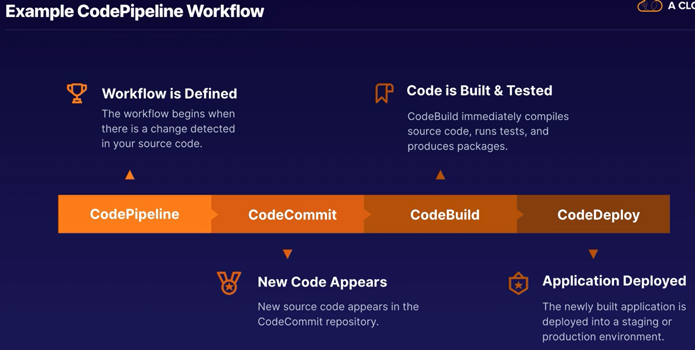

<br>[top of page](#aws-certified-developer-associate-notes)<br>


# CodeArtifact
### Overview
- An artifact repository that makes it easy for developers to find the software packages they need
- Artifacts include:
  - Documentation
  - Compiled applications
  - Deployable packages
  - Libraries
- Securely store, publish, and share artifacts
- Mainly used to store and share software packages in your software development process
- Can include open-source or in-house software
- A central repository that can be used by all your developers to obtain the correct versions of the software packages required for their projects
- Can link to public repositories such as: npm registry, and Python Package Index
- Can be used by AWS resources such as CodeBuild to get the most

### Integrating with public repositories
- Steps:
  - `Create a domain`
    - Create a repository (my-repo)
    - Create an upstream repository (npm-store)
  - `Add an external connection`
    - Connect npm-store to the public npm registry
  - `Associate the upstream repository to the repository in your domain`
    - Associate npm-store with my-repo
  - `Install a package`
    - Use the npm CLI to install the Espress package into my-repo

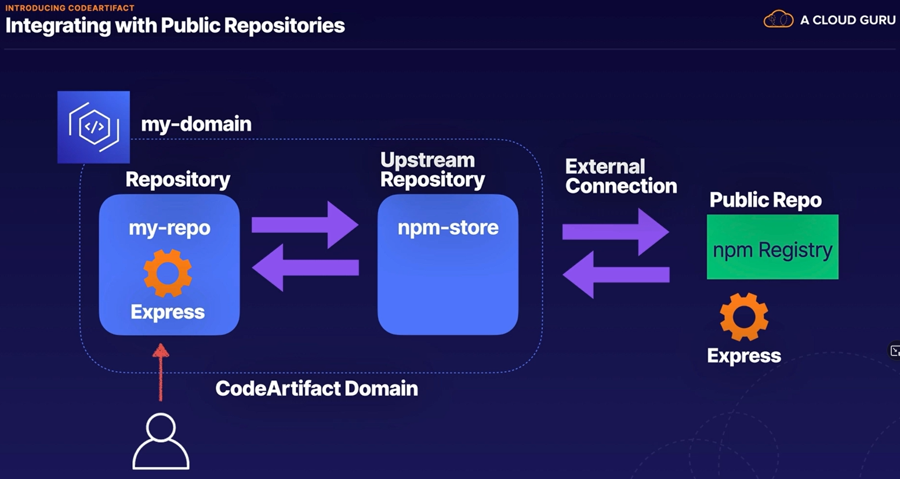

### Example Code:
```
1) Create a domain:
aws codeartifact create-domain --domain my-domain

2) Create a repository in your domain:
aws codeartifact create-repository --domain my-domain --repository my-repo

3) Create an upstream repository for your my-repo repository:
aws codeartifact create-repository --domain my-domain --repository npm-store

4) Add an external connection to the npm public repository to your npm-store repository:
aws codeartifact associate-external-connection --domain my-domain --repository npm-store --external-connection "public:npmjs"

5) Associate the npm-store repository as an upstream repository to the my-repo repository:
aws codeartifact update-repository --repository my-repo --domain my-domain --upstreams repositoryName=npm-store

6) Configure the npm package manager with your my-repo repository (fetches an authorization token from CodeArtifact using your AWS credentials):
aws codeartifact login --tool npm --repository my-repo --domain my-domain

7) Use the npm CLI to install an npm package. For example, to install the popular npm package express, use the following command, if we don’t specify a version, this command will install the latest version available in the external repo:
npm install express

(express is a Node.js web application framework used to develop web and mobile applications)

8) View the package you just installed in your my-repo repository:
aws codeartifact list-packages --domain my-domain --repository my-repo


You now have three CodeArtifact resources:
* The domain my-domain.
* The repository my-repo that is contained in my-domain. This repository has an npm package available to it.
* The repository npm-store that is contained in my-domain. This repository has an external connection to the public npm repository and is associated as an upstream repository with the my-repo repository.

9) To avoid further AWS charges, delete the resources you created:
aws codeartifact delete-repository --domain my-domain --repository my-repo
aws codeartifact delete-repository --domain my-domain --repository npm-store
aws codeartifact delete-domain --domain my-domain
```

<br>[top of page](#aws-certified-developer-associate-notes)<br>


# Serverless AWS Services

### Lambda
- Building a function:
  - Runtime: The environment that your code will run in.
  - Permissions: If your lambda function needs to make an AWS API call, you'll need to attach a role
  - Networking: You can (optionally) define the VPC, subnet, and security groups your functions are a part of
  - Resources: Defining the amount of available memory will allocate how much CPU and RAM your code gets
  - Trigger: What's going to alert your Lambda function to start? Defining a trigger will kick Lambda off if that event occurs
- 15 minute maximum runtime

### Container
- Standard unit of software that packages up code and all its dependencies, to the application runs quickly and reliably from one computing environment to another
- Dockerfile:
  - Text document tnat contains all the commands or instructions that will be used to build an image
- Image:
  - Immutable file that contains the code, libraries, dependencies, and configuration files needed to rum an application
- Registry:
  - Stores Docker images for distribution
  - Can be both public and private
- Container:
  - A running copy of the image that has been created
- ECS is the preferred service on the exam

### Elastic Container Service (ECS)
- Proprietary AWS container service
- Features:
  - Management of containers at scale (thousands or even millions)
  - Appropriately places the containers and keeps them online
  - Elastic Load Balancer integration
    - Containers are appropriately registered with the load balancers as they come online and go offline
  - Role integration
    - Containers can have individual roles attached to them, making security a breeze
  - Ease of use
    - Extremely easy to set up and scale to handle any workload

### Elastic Container Registry
- Place to store your container images
- ECS connects to the registry and uses Docker to deploy the container images

### Kubernetes
- Origionally built by Google
- Open-source container management
- Can be used on-premises and in the cloud
- AWS-managed version is called Elastic Kubernetes Service (EKS)

### Fargate
- Serverless compute engine for containers
- Works on both Amazon ECS and EKS
- Fargate doesn't work by itself - ECS or EKS requirement
- Runtime and Resource utilization determine cost
- More expensive than EC2, but easier to use

### EC2 vs. Fargate
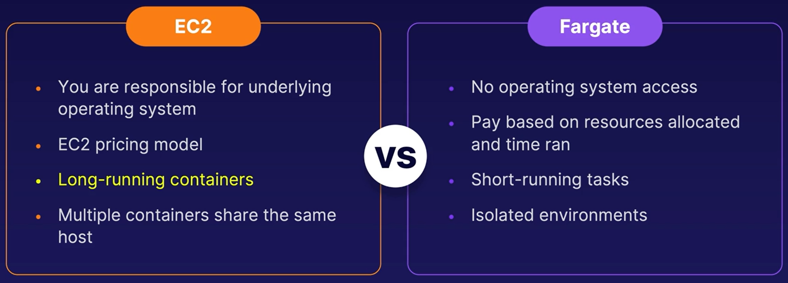

### Fargate vs. Lambda
- Fargate:
  - Select Fargate when you have more consistent workloads
  - Allows Docker use across the organization and a greater level of control by developers
- Lambda:
  - Great for unpredictable or inconsistent workloads
  - Perfect for applications that can be expressed as a single function

### When to use each option
- Lambda:
  - For lightweight functions that can run very quickly
  - Generally need to be integrated into the AWS architecture
- Fargate:
  - For when you have containers that don't need to run all the time
- EC2:
  - For when you have containers that need to run 24/7
  - When you're concerned about costs

### EventBridge
- Formerly known as CloudWatch Events
- Serverless event bus
- Allows you to pass events from a source to an endpoint
- It's the glue that holds your serverless application together
- Creating a Rule:
  1. Define Pattern:
     - Do you want the rule to be invoked based on an event happening, or do you want this to be scheduled
  2. Select Event Bus:
     - Is this going to be an AWS-based event, a custom event, or a partner
  3. Select your target:
     - What happens when this event kicks off
     - Do you trigger a Lambda function, Post to an SQS queue, or send an E-mail
  4. Tag it:
     - You need to tag everything
  5. Sit back:
     - Wait for the event to happen, or kick it off yourself to make sure it's working correctly

<br>[top of page](#aws-certified-developer-associate-notes)<br>


# CloudFormation
### Overview
- Manage, configure, and provision AWS infrastructure as code (IaC)
- Resources are defined using a CloudFormation Template
- CloudFormation interprets the template and makes the appropriate API calls to create the resources you have defined
- Templates support YAML or JSON
- Benefits:
  - `Consistent`
    - Infrastructure is provisioned consistently, with fewer mistakes
  - `Quick and efficient`
    - Less time and effort than configuring things manually
  - `Version Control`
    - You can version control and peer review your templates
  - `Free to use`
    - Free to use but you are charged for the AWS resources you create using CloudFormation
  - `Manages Updates`
    - Can be used to manage updates and dependencies
  - `Rolling Back`
    - You can roll back to a previous state and delete the entire stack as well

### Steps for use
1. YAML or JSON template is created
2. Template is uploaded to CloudFormation using S3
3. CloudFormation reads the template and makes the API calls on your behalf
4. The resulting set of resources that CloudFormation builds from your template is called a "stack"

### Template
- Sections:
  - `Parameters`
    - Input custom values
  - `Conditions`
    - Provision resources based on environment
  - `Resources`
    - Only mandatory section of the template
    - Describes the AWS resources that CloudFormation will create
  - `Mappings`
    - Allows you to create custom mappings like "Region : AMI"
  - `Transform`
    - For referencing additional code stored in S3, allowing for code re-use

### Exporting CloudFormation stack values
- You can import values output from the creation of one stack into the creation of another stack
- Outputs:
  - Use the `Outputs` section to define variables that you would like to export to other CloudFormation templates
  - Example:
    ```
    "Outputs" : {
        "VPCId" : {
          "Description" : "VPC ID",
          "Value" :  { "Ref" : "VPC" },
          "Export" : { "Name" : {"Fn::Sub": "${AWS::StackName}-VPCID" }}
        },
        "PublicSubnet" : {
          "Description" : "The subnet ID to use for public web servers",
          "Value" :  { "Ref" : "PublicSubnet" },
          "Export" : { "Name" : {"Fn::Sub": "${AWS::StackName}-SubnetID" }}
        },
        "WebServerSecurityGroup" : {
          "Description" : "The security group ID to use for public web servers",
          "Value" :  { "Fn::GetAtt" : ["WebServerSecurityGroup", "GroupId"] },
          "Export" : { "Name" : {"Fn::Sub": "${AWS::StackName}-SecurityGroupID" }}
        }
      }
    ```
    > Notice that the `PublicSubnet`, and `WebServerSecurityGroup` have export sections that define a `Name` that is used in the import example below
- Imports
  - Example:
    ```
    "GroupSet": [
      {
        "Fn::ImportValue": {
          "Fn::Sub": "${NetworkStackParameter}-SecurityGroupID"
        }
      }
    ],
    "AssociatePublicIpAddress": "true",
    "DeviceIndex": "0",
    "DeleteOnTermination": "true",
    "SubnetId": {
      "Fn::ImportValue": {
        "Fn::Sub": "${NetworkStackParameter}-SubnetID"
    ```

### Serverless Application Model (SAM)
- An extension the CloudFormation used to define and provision serverless applications
- Uses a simplified syntax for defining serverless resources such as:
  - APIs
  - Lambda functions
  - DynamoDB tables
  - etc..
- Use the SAM CLI to package your deployment code, and uploads it to S3
- Useful commands:
  - `sam package`
    - Takes a yaml template and outputs a SAM compatable template and uploads a deployment package to an S3 bucket
    - Example:
      ```
      sam package \
         --template-file ./mytemplate.yml \
         --output-template-file sam-template.yml \
         --s3-bucket s3-bucket-name
      ```
  - `sam deploy`
    - Takes the sam-template.yml file from the previous command, gives the stack a name, assigns an IAM role, and deploys the stack
    - Example:
      ```
      sam deploy \
         --template-file sam-template.yml \
         --stack-name mystack \
         --capabilities CAPABILITY_IAM
      ```

### Nested Stacks
- Enable re-use of CloudFormation code for common use cases
- Allows you to reference other templates that you have from within your CloudFormation template
- Useful for frequently used configurations, e.g. load balancers, web or application servers
- Steps:
  1. Create the template
  2. Store it in AWS S3
  3. Reference the template in the `Resources` section of any CloudFormation template using the `Stack` resource type

<br>[top of page](#aws-certified-developer-associate-notes)<br>


# Amazon Cognito
### Web Identity Federation overview
- Simplifies authentication and authorization for web applications
- Use:
  - Users access AWS resources after successfully authenticating with a web-based identity provider like Facebook, Amazon, or Google
  - Following successful authentication, users receive an authentication code from the web ID provider
  - Users can trade this authentication code for temporary AWS security credentials, authorizing access to AWS resources

### Web Identity Federation with Cognito
- Provides web ID federation:
  - Sign-up
  - Sign-in
  - Functionality for your applications
  - Accss for guest users
- Manages authentication between your application and web ID providers
- Synchronizes user data for multiple devices
- Recommended for all mobile applications that call AWS services

### User Pools
- User directories used to manage the following for mobile and web applications:
  - Sign-up functionality
  - Sign-in functionality

### Identity Pools
- Enable you to provide temporary AWS credentials
- Enables access to AWS services like S3 or DynamoDB

### Example Cognito Use Case
- User is on application and selects Facebook to login
- User is directed to Facebook for login
- A Cognito user pool brokers the sign-up and sign-in functionality
- After successful login, Facebook returns a JSON Web Token (JWT)
- JWT is exchanged for AWS credentials by the Cognito Identity Pool
- These AWS credentials map to an AWS IAM role
- The AWS IAM role then gives the user access to AWS resources

### Cognito Push Synchronization
- Cognito tracks the association between user identity and the various different devices the sign-in from
- Cognito uses Push Synchronization to push updates and synchronize user data across multiple devices
- SNS notification to all the dveices associated with a given user identity whenever data stored in the cloud changes

<br>[top of page](#aws-certified-developer-associate-notes)<br>


# CloudWatch
### Overview
- Use the CloudWatch agent for operating system-level metrics like memory usage, processes, and CPU idle time
- Default host-level mertics:
  - CPU
  - Network
  - Disk
  - Status check
- Concepts:
  - `Metrics`
    - A variable to monitor:
      - CPU usage
      - etc...
  - `Namespace`
    - A container for CloudWatch metrics
    - e.g., EC2 uses the AWS/EC2 namespace
  - `Dimensions`
    - Similar to a filter
    - e.g., use the InstanceId dimension to search for metrics relating to a specific EC2 instance
  - `Dashboard`
    - A custom homepage that you create in CloudWatch
    - Display import metrics for all of you production systems in one place
### CloudWatch Logs
- Monitor and store your logs to help you better understand your systems and applications
### CloudWatch Alarms
- You can create an alarm to monitor any Amazon CloudWatch metric in your account
- Generate an alert
- Take some action
### CloudWatch Actions
- Allow you to publish, monitor, and alert on a variety of metrics
- `PutMetricData` : publishes metric data points to CloudWatch
- `PutMetricAlarm` : Creates and alarm associated with a metric to alert you if a threshold has been reached


<br>[top of page](#aws-certified-developer-associate-notes)<br>