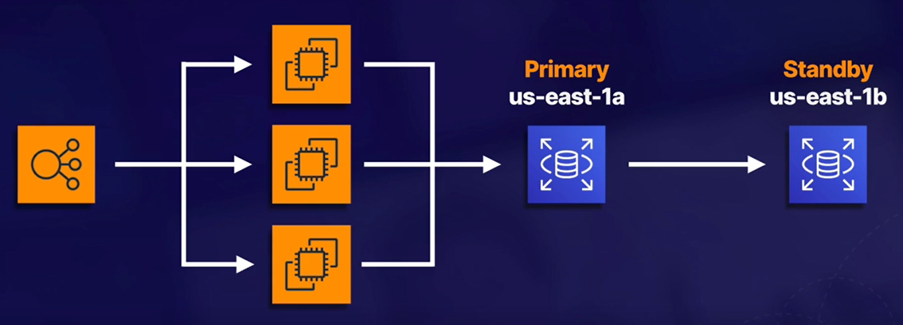
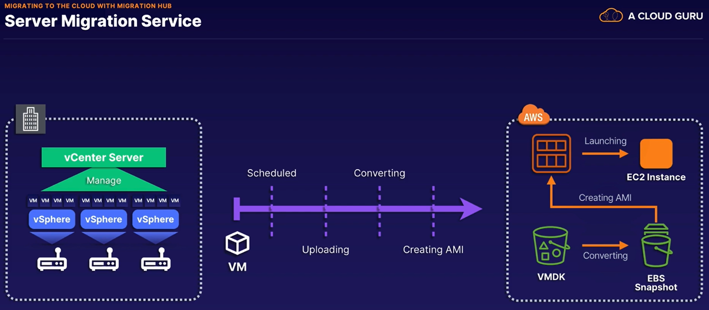

# AWS Certified Solutions Architect Associate

### Documentation
- [AWS Shared Responsibility Model](https://aws.amazon.com/compliance/shared-responsibility-model/)
- [AWS Well-Architected Framework Whitepaper](https://docs.aws.amazon.com/wellarchitected/latest/framework/welcome.html?did=wp_card&trk=wp_card)

### Key services to know for the exam:
##### Compute:
- EC2
- Lambda
- Elastic Beanstalk
##### Storage:
- S3
- EBS
- EFS
- FSx
- Storage Gateway
##### Databases:
- RDS
- DynamoDB
- Redshift
##### Networking:
- VPCs
- Dircet Connect
- Route 53
- API Gateway
- AWS Global Accelerator

### Five Pillars of the Well-Architected Framework
1. Operational Excellence
   - Focuses on funning and monitoring systems to deliver business value, and continually improving processes and procedures.
2. Performance Efficency
   - Focuses on using IT and computing resources efficiently.
3. Security
   - Focuses on protecting information and systems.
4. Cost Optimization
   - Focuses on avoiding unnecessary costs.
5. Reliability
   - Focuses on ensuring a workload performs its intended function correctly and consistently when it's expected to.

### Identity Access Management (IAM)
- Allows your to manage users and their level of access to the AWS console.
##### Actions:
- Create users and grant permissions to those users.
- Create groups and roles.
- Control access to AWS resources.
##### Best way to secure Admin accounts:
- Enable multi-factor authentication on the root account.
- Create an admin group for your administrators, and assign the appropriate permissions to this group.
- Create user accounts for your administrators.
- Add your users to the admin group.
##### Permissions
- Defined in IAM `Policy Documents` (JSON files)
  - Can be assigned to Groups, Users, and Roles.
  - For example:
    ```json
    {
      "Version": "2012-10-17",
      "Statement": [
          {
              "Effect": "Allow",
              "Action": "*",
              "Resource": "*"
          }
      ]
    }
    ```
##### Building Blocks:
- Users: A physical person
- Groups: Functions, such as administrator, developer, etc. Contains users.
- Roles: Internal usage within AWS. Allows one part of AWS to talk to another.
##### Exam Tips:
- Access key ID and secret access keys are not the same as usernames and passwords.
- New users have no permissions when created.

### Simple Storage Service (S3)
- Object storage
- Unlimited stroage
- Objects up to 5TB in size
- Stored in S3 buckets
- Universal namespace
- URL naming convention:
  ```html
  https://bucket-name.s3.Region.amazonaws.com/key-name
  ```
  - Example
    ```html
    https://acloudguru.s3.us-east-1.amazonaws.com/Ralphie.jpg
    ```
- Works off of a key:value store
- Stores a version ID and metadata
- Successful CLI or API uploads will generate an HTTP 200 status code.
- Data is spread across multiple devices and facilities to ensure availabilty and durability
- Availability 99.95 - 99.99
- Durability 99.999999999 (9 decimal places)
- Lifecycle management
  - Rules to automatically transition objects to a cheaper storage tier or delete objects that are no longer required after a set period of time.
##### Securing data
- Server-side encryption: default encryption on a bucket to encrypt all new objects when they are stored in the bucket.
- Access Control Lists (file level): define which accounts or groups are granted access and the type of access. Can be attached to individual objects in a bucket.
- Bucket Policies (bucket level): specify what actions are allowed or denied (e.g., allow user Alice to PUT but not DELETE objects in the bucket).
- Buckets are private by default: When you create an S3 bucket, it is private by default (including all objects within it). You have to allow public access on both the bucket and its objects in order to make the bucket public.
- S3 scales automatically with demand.
##### Versioning
- Can have multiple versions of an object within S3
- Once enabled, cannot be removed. can only be suspended.
- Can use MFA for deletion
- Public access policies don't apply to previous versions of objects in S3.
- Deleting an object with version control on, only creates a delete marker, it does not delete the versions of the object.
- To restore files with delete markers, delete the delete markers.
##### Storage Classes
- S3 Standard
  - Stored in >= 3 AZ
  - Perfect for frequent access
  - Default storage class
  - Use cases: websites, content distro, mobile and gaming applications, and big data analytics
- S3 Standard-Infrequent Access
  - Low per-GB storage price
  - A per-GB retrieval fee
  - Use cases: long-term storage, backups, and as a data store for disaster recovery files.
- S3 One Zone-Infrequent Access
  - Only in one AZ
  - Costs 20% less than S3-IA
  - Good for non-critical data
- S3 Intelligent-Tiering
  - Automatically moves your data to the most cost-effective tier based on how frequently you access each object.
  - Optimizes cost
- Glacier:
  - You pay each time you access your data
  - Use only for archiving data
  - Cheap storage
  - Optimized for data that is very infrequently accessed.
  - S3 Glacier Options:
    1. Glacier Instant Retrieval
        - Long-term data archiving
        - Instant retrieval time for your data
    2. Glacier Flexible Retrieval
        - Retrieval in minutes, or up to 12 hours
    3. Glacier Deep Archive
        - Cheapest storage class
        - Standard retrieval time is 12 hours
        - Bulk retrieval time is 48 hours
##### Life Cycle Management
- Automates moving your objects between the different storage tiers for cost effectiveness
- Can be used to move different versions of objects to different storage tiers
##### Object lock
- Stores objects using a write once, read many (WORM) model.
- Can help prevent objects from being deleted or modified for a fixed amount of time or indefinitely.
- Use to meet reglatory requirements, or add extra layer of protection against object changes and deletions.
- Modes:
  1. Governance
      - Users can't overwrite or delete an object version or alter its lock settings unless they have special permission
  2. Compliance
      - No one (including root) can overwrite or delete the object for the duration of the retention period
- Legal Holds:
  - Prevents an object version from being overwritten or deleted
  - No retention period
  - In effect until legal hold is removed
  - Placed and removed by users with permission: `s3:PuObjectLegalHold`
##### Glacier Vault Lock:
- Easily deploy and enforce compliance controls for individual S3 Glacier vaults
- Once locked, the policy can no longer be changed.
##### Encryption
- Types:
  - In transit:
    - SSL/TLS
    - HTTPS
  - At rest: Server-side encryption
    - SSE-S3: S3-managed keys, using AES 256-bit encryption
    - SSE-KMS: AWS Key Management Service-managed keys
    - SSE-C: Customer-provided keys
  - At rest: Client-side encryption
    - You encrypt the files yourself before you upload them to S3.
- Can enforce server-side encryption through:
  - Console: select the encryption setting on your S3 bucket
  - Bucket Policy
##### S3 Prefixes:
- The folders inside a bucket
- Does not include the object and file type
##### S3 performance
- First byte out within 100-200 milliseconds
- Requests per second per prefix:
  - 3500 PUT/COPY/POST/DELETE
  - 5500 GET/HEAD
- KMS request rates:
  - Region-specific, however, it's either 5.5k, 10k, or 30k requests per second
  - Up/down loading counts towards KMS quota
  - Currently cannot request a quota increase
- Multipart uploads
  - Parallelize uploads
  - Recommended for files over 100 MB
  - Required for files over 5 GB
- S3 Byte-range fetches
  - Parallelize downloads by specifying byte ranges
- S3 Replication
- You can replicate objects from one bucket to another
- Versioning must be enabled on both the source and destination buckets
- Objects in an existing bucket are not replicated automatically
- Once replication is turned on, all subsequent updated objects will be replicated automatically
- Delete markers are not replicated by default, but can be if configured as such


### EC2

##### Pricing Options
1. On-Demand
    - Pay by the hour or second depending on instance type
2. Reserved
    - Contracts for 1 to 3 years
    - Up to 72% discount on hourly charge
3. Spot
    - Purchase unused capacity at a discout of up to 90%
    - Prices fluctuate with supply and demand
4. Dedicated
    - Physical EC2 server dedicated for your use.
    - Most expensive option

##### Granting permission through ROLES
- Roles are preferred from a security perspective
- Avoid Hard-Coding your credentials
- Policies control a Role's permissions
- Updates to a policy attached to a Role take effect immediately
- Roles can be attched and detached on running EC2 instances without having to stop or terminate those instances

##### Meta Data
- View it from the CLI with the curl command:
  ```
  curl http:/169.254.169.254/latest/meta-data
  ```
  > The IP address is always the same
- View user data (bootstrap script) in the same way:
  ```
  curl http:/169.254.169.254/latest/user-data
  ```

##### Virtual Networking Options
1. Elastic Network Interface (ENI)
    - Allows:
      - Private IPv4 addresses
      - Public IPv4 addresses
      - MAC address
      - Many IPv6 addresses
      - 1 or more security groups
    - Common use cases:
      - For basic day-to-day networking
      - Create a management network
      - Use network and security appliances in your VPC
      - Create dual-homed instances with workloads/roles on distinct subnets
      - Create a low-budget, high-availability solution
2. Enhanced Networking (EN)
    - Bandwidths of 10 Gbps - 100 Gbps
    - Single root I/O virtualization (SR-VIO)
    - Higher bandwidth
    - Higher packets per second
    - Lower inter-instance latencies
    - Can be enabled using:
      1. Elastic Network Adapter
        - Up to 100 Gbps
      2. Intel 82599 Virtual Function Interface
        - Up to 10 Gbps
        - Typically used on older instances
3. Elastic Fabric Adapter (EFA)
    - Accelerates High Performance Computing (HPC) and machine learning applications
    - Lower and more consistent latency and higher throughput than the TCP transport traditionally used in cloud-based HPC systems
    - Can use `OS-BYPASS` which enables HPC and machine learning applications to bypass the OS system kernel and communicate directly with the EFA device (Linux only)

##### Placement Groups
- Types:
  - Cluster:
    - Grouping of instances within a single AZ
    - Good for apps that need low network latency, high network throughput, or both
    - Only certain instance types can be launched into a cluster placement group
  - Spread
    - Group of instances placed on distinct underlying hardware
    - Good for apps that have a small number of critical instances that should be kept seperate from each other
  - Partition
    - Group has its own set of racks
    - Each rack has its own power and network
- Only certain instance types can be in a placement group:
  - Compute optimized
  - Memory optimized
  - Storage optimized
- AWS recommends homogenous instances within cluster placement groups
- Placement groups cannot be merged

##### Spot Instances
- Best for:
  - Big data analytics
  - Containerized workloads
  - CI/CD and testing
  - Image and media rendering
  - High-performance computing
- 2 minutes to stop or terminate after spot price goes over your maximum spot price
- `Spot Block`
  - Stops your Spot instances from being terminated even if the Spot price goes over your max Spot price.
  - Set Spot blocks for between `1 to 6 hours`
- Spot request types:
  - One-time: only fill the spot request once
  - Persistent: continues to fill the spot request until the spot request is deleted
- `Spot Fleets`
  - Collection of Spot instances and (optionally) On-Demand instances
  - Try to match the target capacity with your price restraints
- Strategies
  - Capacity Optimized
    - Spot instances come from the pool with optimal capacity for the number of instances launching
  - Lowest Price
    - Spot instances come from the pool with the lowest price
    - Default strategy
  - Diversified
    - Spot instances are distributed across all pools
  - Instance Pools To Use Count
    - Spot instances are distributed across the number of Spot instance pools you specify
    - This is only valid when used in combination with lowest price strategy


### Elastic Block Storage (EBS)

##### Overview
- Storage volumes you can attach to your EC2 instances
- Use them the same as any system disk
  - Create a filesystem
  - Run a database
  - Run an operating system
  - Store data
  - Install applications

##### Mission Critical
- Designed for mission-critical workloads
- Automatically replicated within a single AZ to protect against hardware failures
- Scales with no downtime

##### Types
- Solid State Drive (SSD)
  Storage Type | IOPs per Vol | IOPs per GiB
  --|--|--
  GP2 | 16k | 3
  GP3 | 16k | ?
  IO1 | 64k | 50
  IO2 | 64k | 500

  - `General Purpose SSD (GP2)`
    - Balance of price and performance
    - Good for boot volumes or developmental
  - `General Purpose SSD (GP3)`
    - Balance of price and performance
    - Good for apps that need high performance at a low cost:
      - MySQL
      - Cassandra
      - Virtual desktop
      - Hadoop analytics
    - Top performance of gp3 is 4x faster than max throughput of gp2
  - `Provisioned IOPS SSD (IO1)`
    - High performance option and the most expensive
    - Designed for I/O-intensive apps:
      - Large databases
      - Latency-sensitive workloads
  - `Provisioned IOPS SSD (IO2)`
    - Latest generation
    - Higher durability and more IOPs than io1
    - Same price as io1
    - Uses same as io1
- Hard Disk Drive (HDD)
  Storage Type | Baseline IOPs per TB | Burst IOPs per TB | Max IOPs per Vol. 
  --|--|--|--
  SC1 | 12 | 80 | 250
  ST1 | 40 | 250 | 500
  - `Cold HDD (SC1)`
    - Lowest cost option
    - Cannot be a boot volume
    - Best for:
      - Colder data requiring fewer scans per day
      - Apps that need the lowest cost and performance is not a factor
  - `Throughput Optimized HDD (ST1)`
    - Low cost
    - Cost effective way to store mountains of data
    - Cannot be a boot volume
    - Best for:
      - Frequently accessed, throughput-intensive workloads
      - Big data, data wharehouse, ETL, and log processing

##### IOPs vs. Throughput
- IOPs
  - Number of read/write ops per second
  - Important for:
    - Quick transactions
    - Low-latency apps
    - Transactional workloads
  - Choose IO1 or IO2
- Throughput
  - Number of bits read or written per second
  - Important for:
    - Large data-sets
    - Large I/O sizes
    - Complex queries
  - Choose ST1

##### Volumes
- Virtual hard disks
- Need minimum of 1 volume per EC2 instance (root device volume)
- Location: will always be in the same AZ as the EC2 instance they are attached to
- Resizing: can resize on the fly, but will need to extend the file system in the OS
- Volume Type: can change volume types on the fly

##### Snapshot
- Point-in-time copy of a volume
- Exist on S3
- Incremental snapshot: Only the data that has been changed since your last snapshot are moved to S3
- Recommended to stop instance to take a snapshot
- Snapshots of encrypted EBS volumes will be encrypted automatically
- Snapshots can be shared, but only in the region in which they were created
- To share to other region, you need to copy them to the destination region first

##### Encryption
- AES-256
- To encrypt volumes and snapshots, AWS uses:
  - AWS Key Management Service (AWS KMS)
  - Customer master keys (CMK)
- Result:
  - Data at rest is encrypted in the volume
  - Data in flight between instance and volume is encrypted
  - Snapshots are encrypted
  - Volumes created from snapshot are encrypted
- Process to encrypt an unencrypted volume:
  1. Create snapshot of unencrypted root device volume
  2. Create a copy of the shapshot and select the encrypt option
  3. Create and AMI from the encrypted snapshot
  4. Use that AMI to launch new encrypted instances

##### Hibernation

- If an instance is stopped, the data is kept on the disk (with EBS)
- If an instance is terminated, then by default the root device volume will also be terminated
- In Hibernation:
  - OS is told to perform hibernation (suspend-to-disk)
  - Saves the contents from the instance memory (RAM) to your Amazon EBS root volume
  - The instance's Amazon EBS root volume and any attached Amazon EBS data volumes persist
- When starting instance out of hibernation:
  - Amazon EBS root volume is restored to its previous state
  - RAM contents are reloaded
  - Processes that were previously running on the instance are resumed
  - Previously attached data volumes are reattahced and the instance retains its instance ID
- Limitations:
  - Instance RAM must be less than 150 GB
  - Instance families include C3, C4, C5, M3, M4, M5, R3, R4, and R5
  - Available for Windows, Amazon Linux 2 AMI, and Ubuntu
  - Instances cannot be hibernated for more than 60 days


### Elastic File Sysstem (EFS)

##### Overview
- Managed Network File System (NFS) that can be mounted on many EC2 instances
- EFS works with EC2 instances in multiple AZs
- EFS is regional
- A way for EC2 instances to share data from a single EFS source
- Highly available and scalable
- Expensive
- Uses NFSv4 protocol
- Compatible with Linux-based AMI (Windows not supported at this time)
- Encryption at rest using KMS
- File system scales automatically; no capacity planning required
- Pay per use


##### Performance:
  - Can support thousands of concurrent connections
  - Handle up to 10 Gbps throughput
  - Scales in petabytes

##### Storage Tiers
  - Standard
  - Infrequently Accessed


### FSx for Windows File Server (FSx)

##### Overview
- Fully managed native Microsoft Windows file system
- Easily move your Windows-based apps that require file storage to AWS
- Built on a Windows server


### Amazon FSx for Lustre
- Fully managed file system that is optimized for compute-intensive workloads
- Best for:
  - High performance computing
  - Machine learning
  - Media data processing workflows
  - Electric design automation

### Comparison


### Amazon Machine Image (AMI)
##### Overview
- Can be based on:
  - Region
  - OS
  - Architecture (32-bit or 64-bit)
  - Launch permissions
  - Storage for the root device (root device volume)
- All AMIs are categorized as either backed by:
  - Amazon EBS: The root device for an instance launched from the AMI is an Amazon EBS volume created from an Amazon EBS snapshot.
  - Instance Store:
    - The root device for an instance launched from the AMI is an instance store volume created from a template stored in Amazon S3.
    - Cannot be stopped
    - You can reboot the instance without losing your data
    - If you delete the instance, you will lose the instance store volume


### AWS Backup
##### Overview
- Allows you to consolidate your backups across multiple AWS services such as:
  - EC2
  - EBS
  - EFS
  - Amazon FSx for Lustre
  - Amazon FSx for Windows File Server
  - AWS Storage Gateway
- Can also be used with AWS Organizations
  - Gives you centralized control across all AWS services, in multiple AWS accounts across the entire AWS organization

##### Benefits
- Central Management:
  - Single, central backup console, allowing you to centralize your backkups across multiple AWS services and multiple AWS accounts.
- Automation:
  - Can create automated backup schedules
  - Can create lifecycle ploicies, allowing you to expire unnecessary backups after a period of time
- Improved Compliance:
  - Backup policies can be enforced while backups can be encrypted both at rest and in transit, allowing alignment to reglatory compliance
  - Auditing is made easy due to a consolidated view of backups across many AWS services


### Storage Options


# Databases

### Relational Database Service (RDS)
##### Overview
- Available Database Engines
  - SQLServer
  - Oracle
  - PostrgeSQL
  - MariaDB
  - MySQL
  - Amazon Aurora
- Multi AZ
- Failover capability
- Automated backups
- Generally used for Online Transaction Processing (OLTP)
    - Processing and completing large nubmers of small transactions in real time
  - Online Analytical Processing (OLAP) should be done on Redshift data warehouse
    - Data analysis using large amounts of data
    - Complex queries that take a long time to complete

##### Multi-AZ
- These can be multi-az:
  - SQLServer
  - MYSQL
  - MariaDB
  - Oracle
  - PostgreSQL



- RDS will automatically fail over to the standby during a failure so database operations can resume quickly

### Read Replicas
- Read only copy of your primary database
- Scales up read performance
- Requires automatic backup
- Multiple read replicas are supported
- Great for read-heavy workloads
- Can be cross AZ
- Can be cross Region
- Each read replica has its own DNS endpoint
- Can be promoted to be their own databases - breaks replication


### Amazon Aurora

##### Overview
- A MySQL and PostgreSQL-compatible relational database enging
- Combines the speed and availability of high-end commercial databases with the simplicity and cost-effectiveness of open-source databases

##### Offerings
- Starts with 10GB
- Scales in 10-GB increments to 128 TB (storage auto scaling)
- Compute resources can scale up to 96 vCPUs and 768 GB of memory
- Deployment of your database
  - 2 copies of your data are contained in each AZ
  - Minimum of 3 zones
  - 6 copies of your data

##### Replicas
  - Aurora: you can have 15
  - Aurora MySQL: you can have 5
  - Aurora PostgreSQL: you can have 5
  - Automated failover is only available with Aurora replicas

##### Performance
- 5X better than MySQL
- 3X better than PostgreSQL

##### Backups
- Always enabled on Amazon Aurora DB instances
- Do not impact performance
- Can also take snapshots - does not impact performance
- Can share snapshots with other AWS accounts

##### Serverless
- On-demand
  - Automatically starts up, shuts down
- Auto-scaling
  - Automatically scales up or down
- Only pay for it when you are using it
- Use cases
  - Infrequent, itermittent, or unpredictable workloads


### Amazon Dynamo DB
##### Overview
- Fast and flexible NoSQL database
- Fully managed
- Supported data models:
  - Document
  - Key-value
- Good for mobile, web, gaming, ad-tech, IoT, etc...
- Single-digit millisecond latency

##### Tech specs
- Stored on SSD storage
- Spread across 3 geographically distinct data centers
- Eventual consistent reads (default)
- Strongly consistent reads


##### DynamoDB Accelerator (DAX)
- Fully managed, highly available, in-memory cache
- 10X performance improvement
- Reduces request times from milliseconds to microseconds - even under load
- No need for developers to manage caching logic
- Compatible with DynamoDB API calls

##### On-Demand Capacity
- Pay-per-request pricing
- No minimum capacity
- Pay more per request than with provisioned capacity
- Use for new product launches

##### Security
- Encrypted at rest using KMS
- Site-to-site VPN
- Direct Connect (DX)
- IAM policies and roles
- Fine-grained access
- Integrates with CloudWatch and CloudTrail
- VPC endpoints

##### DynamoDB Transactions
- DynamoDB transactions provide developers ACID across 1 or more tables within a single AWS account and region
- Up to 25 items or 4 MB of data
- ACID basically means all or nothing transactions (atomicity, consistency, isolation, and durability)


- Read options:
  - Eventual consistency
  - Strong consistency
  - Transactional

- Write options:
  - Standard
  - Transactional

- Use for:
  - Processing financial transactions
  - Fulfilling and managing orders
  - Building multiplayer game engines
  - Coordinating actions across distributed components and services

##### DynamoDB On-Demand Backup and Restore
- Full backups at any time
- Zero impact on table performance or availability
- Consistent within seconds and retained until deleted
- Operates within same region as the source table

##### DynamoDB Point-in-Time Recovery (PITR)
- Protects against accidental writes or deletes
- Restore to any point in the last 35 days
- Incremental backups
- Not enabled by default
- Latest restorable: 5 minutes in the past

##### DynamoDB Streams
- Time-ordered sequence of item-level changes in a table
- First in first out (FIFO)
- Inserts, updates, and deletes
- Stored for 24 hours


##### DynamoDB Global Tables
- Managed multi-master, multi-region replication
- Globally distributed applications
- Based on DynamoDB streams
- Multi-region redundancy for disaster recovery or HA
- Replication latency under 1 second
- No application rewrites
- Table replicants must be deleted before the origional table can be deleted


# VPC
### Overview
- Virtual datacenter in the cloud
- Logically isolated part of AWS Cloud where you can define your own network
- Complete control of:
  - IP address ranges
  - Subnets
  - Route tables
  - Network gateways
- Can secure with:
  - Security groups
  - Access Control Lists
- Can create a hardware VPN between corporate data center and your VPC
- Networking restrictions:
  - /28 is the smallest network allowed in a VPC
  - /16 is the largest network allowed in a VPC
- 1 subnet is always in 1 AZ


- VPC Features
  - Launch EC2 instances
  - Internet Gateway
  - Custom IP Addresses
  - More Control
  - Route Tables
  - Access Control Lists
  - Can use Network ACLs to block specific IP addresses


##### Configuration
- By default a VPC creates:
  - Security Group
  - Main route table
  - Main network ACL
- For each subnet, AWS reserves the first 4
- Can only have one Internet Gateway per VPC

##### NAT Gateways
- Used to enable instances in a private subnet to connect to the internet or other AWS services while preventing the internet from initiating a connection with those instances
- Redundant inside the AZ
- Bandwidth:
  - Starts `5 Gbps`
  - Max `45 Gbps`
- No need to patch
- Not associated with security groups
- Automatically assigned a public IP address

##### Security Groups
- Stateful
  - if you send a request from your instance, the response traffic for that request is allowed to flow in regardless of inbound security group rules
  - Responses to allowed inbound traffic are allowed to flow out, regardless of outbound rules

##### Network ACLs
- Optional layer of VPC security
- First line of defense
- Acts as a firewall for controlling traffic in and out of one or more subnets
- Default network ACLs
  - VPC automatically comes with a default network ACL
  - By default allows all outbound and inbound traffic
- Custom network ACLs
  - You can create custom network ACLs
  - By default each custom network ACL denies all inbound and outbound traffic until you add rules
- Subnet association
  - Each subnet in your VPC must be associated with a network ACL
  - If you don't explicitly associate a subnet with a network ACL, the subnet is automatically associated with the default network ACL
- Block IP addreses using network ACLs, not security groups
- Associations
  - One network ACL can be associated with multiple subnets
  - A subnet can only be associated with one network ACL at a time
  - When you associate a network ACL with a subnet, the previous association is removed
- Stateless
  - Network ACLs are stateless
  - Responses to allowed inbound traffic are subject to the rules for outbound traffic (and vice versa)

##### VPC Endpoints
- Allows private connection from your VPC to AWS resources
- All communications between VPC and AWS resources does not leave the Amazon network
- Powered by PrivateLink
- Instances in your VPC do not require public IP addresses to communicate with resources in the service
- They are virtual devices
- Horizontally scales
- Redundant and HA
- Types of endpoints:


##### VPC Peering
- Allows you to connect one VPC to another via a direct network route using private IP addresses
- Instances behave as if they were on the same private network
- You can peer VPCs with other AWS accounts as well as with other VPCs in the same account
- Peering is in a star configurtion
  - No transative peering
  - Full mesh configuration is required for spokes to talk to one another
- You can peer between regions
- Peered VPCs cannot have overlapping CIDR ranges

##### AWS PrivateLink
- Best way to expose a service VPC to tens, hundreds, or thousands of customer VPCs
- Doesn't require VPC peering; no route tables; NAT gateways, internte gateways, etc...
- Requires:
  - Network load balancer on the service VPC
  - Elastic Network Interface on the customer VPC


##### AWS VPN ColoudHub
- Can connect multiple sites together - each having their own VPN connection
- Features:
  - Hub and spoke model
  - Operates over public internet
  - Low cost and easy to manage
  - Operates over the public internet, but all traffic between the customer gateway and the AWS VPN CloudHub is encrypted


##### Direct Connect
- A dedicated network connection from your datacenter to AWS
- Benefits:
  - Reduce network costs
  - Increase bandwidth
  - More consistent network experience
- Types:
  - Dedicated Connection
    - Physical ethernet connection associated with a single customer
    - Customers can request a dedicated connection through:
      - AWS Direct Connect console
      - CLI
      - API
  - Hosted Connection
    - Physical ethernet connection that an AWS Direct Connect Partner provisions on behalf of a customer
    - Customers request a hosted connection by contacting a partner in the AWS Direct Connect Partner Program, who provisions the connection


##### Transit Gateway
- Connects VPCs and on-premises networks through a central hub
- Simplifies network and puts and end to complex peering relationships
- Acts as a cloud router - each new connection is only made once
- You can use route tables to limit how VPCs talk to one another
- Works with Direct Connect as well as VPN connections
- Supports IP multicast (not supported by any other AWS service)


# Route 53
##### Overview
- AWS DNS service
- Domain-name levels:
  - Top: The last word in a domain name represents the top-level domain
  - Second: The second word in a domain name is known as a second-level domain
  - Maintained by Internet Assigned Numbers Authority [here](http://www.iana.org/domains/root/db)
- Domain Registrars
  - Authority that can assign domain names directly under one or more top-levl domains
  - These domains are registered with InterNIC, a service of ICANN, which enforces uniqueness of domain names across the internet
  - Examples:
    - domain.com
    - GoDaddy
    - Hoover
    - AWS
    - Namecheap
- Time to Live (TTL)
  - The length of time that a DNS record is cached on either the resolving server or the user's own local PC
  - The lower the TTL, the faster changes to DNS records take to propagate throughout the internet

##### Common DNS record types:
- SOA (Source of Authority)
  - Name of the server that supplied the data for the zone
  - The administrator of the zone
  - The current version of the data file
  - The default number of seconds for the time-to-live file on resource records
- NS (Name Server)
  - Used by top-level domain servers to direct traffic to the content DNS server that contains the authoritative DNS records
- A (Address)
  - Used by a computer to translate the name of the domain to an IP address
  - Domain name to IP address conversion
  - Can be used for naked domain names (zone apex records)
- CNAME (canonical name)
  - Used to resolve one domain name to another
  - Cannot be used for naked domain names (zone apex records)
  - You can't have a CNAME for http://acloudguru.com
- Alias
  - Used to map resource record sets in your hosted zone to resources that are configured as websites
  - Work like a CNAME record in that you can map one DNS name to another "target" DNS name

##### Routing policies available with route 53
- Simple
  - One record
  - Multiple IP addresses
  - Multiple values in a record
  - All values returned in a random order
- Weighted
  - Similar to Simple routing policy
  - Allows you to split your traffic based on different weights assigned
- Failover
  - Used to create an active / passive setup
  - Route 53 will monitor the health of your primary site using a health check
- Geolocation
  - Choose where your traffic will be sent based on the geographic location of your users
- Geoproximity (traffic flow only)
  - Only available using Traffic Flow service
  - Route traffic based on the geographic location of your users and your resources
  - Can route more or less traffic to a given resource by specifying a value, known as a bias
- Latency-based
  - Route based on lowest network latency for your end user
- Multivalue Answer
  - Similar to simple routing
  - Allows you to check the health of each resource, so Route 53 returns only values for healthy resources
  - Best to create one record for each health check


# Elastic Load Balancer
##### Overview
- Automatically distributes incoming traffic across multiple targets
- Can be done across multiple AZs
- All types can be configured to use health checks
  - Healthy = "InService"
  - Unhealthy = "OutOfService"
  - Unhealthy endpoints will not be used in the load balancing operation
- Deregistration Delay
  - Also known as connection draining
  - Allows Load Balancers to keep existing connections open if the EC2 instances are de-registered or become unhealthy
  - Enables the Load Balancer to complet in-flight requests made to instances that are de-registering or unhelathy
  - You can disable deregistration if you want your load balancer to immediately close connections to the instances that are de-registering or have become unhealty
- Types:
  - Application
    - Operate at layer 7
    - Best for HTTP and HTTPS
    - Support only HTTP and HTTPS
    - Supports use of sticky-sessions, but at the target group level
    - Application-aware
    - Intelligent Load Balancer
    - Can utilize path-based routing
      - Traffic is routed based on the path of the web address
    - HTTPS load balancing
      - You must deploy at least one SSL/TLS server certificate on your load balancer
      - The load balancer uses a server certificate to terminate the frontend connection and then decrypt requests from clients before sending them to the targets
  - Network
    - Operate at layer 4
    - Millions of requests per second
    - Ultra-low latency
    - Performance Load Balancer
    - Process
      1. A listener checks for connection requests from clients, using the protocol and port you configure
      2. The listener on a Network Load Balancer then forwards the request to the target group
         - There are no rules, unlike with Application Load Balancers
         - Does not perform intelligent based routing
      3. Each target group routes requests to one or more registered targets, such as EC2 instances, using the protocol and port number you specify
    - Supported ports and protocols:
      - Protocols:
        - TCP
        - UDP
        - TLS
        - TCP_UDP
      - Ports:
        - 1-65535
    - Encryption:
      - You can use a TLS listener to offload the work of encryption and decryption to your load balancer so your applications can focus on their business logic
      - If the listener protocol is TLS, you must deploy exactly one SSL server certificate on the listener
  - Classic
    - Operate at layer 4 / 7
      - Can use:
        - X-Forwarded-For:
          - Allows the viewing of the original IP address of the client
          - Normally, without X-Forwarded-For, When traffic is sent from a load balancer, the server access logs contain the IP address of the proxy or load balancer only
        - Sticky sessions
          - Allows you to bind a user's session to a specific EC2 instance
          - Ensures all requests from the user during the session are sent to the same instance
    - Load balancer responds with 504 if there is a problem with the application behind the load balancer
    - Legacy load balancer
    - HTTP and HTTPS
    - Classic/Test/Dev Load Balancer


# Monitoring
##### CloudWatch
- Overview:
  - A monitoring and observability platform
  - Was designed to give us insight into our AWS architecture
  - Allows us to monitor multiple levels of our applications and identify potential issues
- Features:
  - System Metrics
  - Application Metrics
  - Alarms (there are no default alarms)
- AWS cannot see past the hypervisor level for EC2 instances
- The more managed a service is, the more checks you get out of the box
- Standar vs. Detailed intervals:
  - Standard = 5 min
  - Detailed = 1 min (additional charge)
- Cloudwatch statistic default period value is 60 seconds


##### CloudWatch Logs
- Features:
  - Allows you to monitor, stor, and access log files from a variety of different sources
  - Gives you the ability to query your logs to look for potential issues or datat the is relevant to you
  - `Filter Patterns`: You can look for specific terms in your logs
  - `Insights`: Allows you to query all your logs using a `SQL`-like interactive solution
  - `Alarms`: Can be created to alert you
  - Services that generate cloudwatch logs:
    - EC2
    - Lambda
    - RDS
    - CloudTrail
    - On-premises
  - Agent based - must be installed and configured (not automatic)
- Terms:
  - Log Event:
    - Record of what happened
    - Contains a timestamp and the data
  - Log Stream:
    - Collection of log events from the same source
  - Log Group:
    - A collection of log streams
- Configuration on EC2 instances:
  - Install cloudwatch agent with the terminal line command:
    ```
    sudo yum install amazon-cloudwatch-agent -y
    ```
  - Run the built-in config wizard, and follow the prompt
    ```
    sudo opt/aws/amazon-cloudwatch-agent/bin/amazon-cloudwatch-agent-config-wizard
    ```
    > Configuration is stored as a JSON document

##### EventBridge
- Uses event patterns to select events and route them to targets
- Event pattern either matches an event or it doesn't
- Event patterns are represented as JSON objects with a structure that is similar to that of events


# High availability and scaling
##### Launch Template / Configs


- Launch Templates: The most up to date and flexible way to create a template
- Launch Configuration: The older version. It's not wrong to use them, but if possible use templates
- User-Data: Is included in the template or configuration
- Change: Can be versioned, configurations are immutable
- Networking: Configs don't include networking information, Templates could

##### Auto Scaling Groups
- Contains a collection of EC2 instances that are treated as a collective group for purposes of scaling and management
- Only used for EC2 instances
- Steps:
  1. Define your template
     - You have to pick from your available launch templates or launch configurations
  2. Networking and Purchasing
     - Pick your networking space and purchasing options
     - Using multiple AZs allows for high availability
  3. Elastic Load Balancer Configuration
     - EC2 instances can be registered behind a load balancer
     - The Auto Scaling Group can be set to respect the load balancer health check
  4. Set Scaling Policies
     - Minimum, maximum, and desired capacity needs to be set to ensure you don't have too many or too few resources
  5. Notifications
     - SNS can act as a notification tool
     - Allows you to let someone know when a scaling event occurs

##### Auto Scaling Restrictions:
  - Minimum
    - The lowest number of EC2 instances you'll ever have online
    - Won't dip below this number
  - Maximum
    - The highest number of EC2 instances you'll ever have online
    - Won't go above this number
  - Desired
    - How many instances do you want right now?

##### Instance Warm-Up and Cooldown
  - Warm-Up:
    - Stops instances from being placed behind the load balancer, failing the health check, and being terminated
  - Cooldown:
    - Pause Auto Scaling for a set amount of time
    - Helps to avoid runaway scaling events
    - Default time is 5 minutes
  - Avoid Thrashing:
    - You want to create instances quickly and spin them down slowly

##### Scaling Types
- Reactive Scaling:
  - You're playing catchup
  - Once the load is there, you must measure it and then determine if you need to create more resources
- Scheduled Scaling:
  - If you have a predictable workload, create a scaling event to get your resources ready to go before they're actually needed
- Predictive Scaling:
  - AWS uses its machine learning algorithms to determine when you'll need to scale
  - They are reevaluated every 24 hours to create a forecast for the next 48 hours

##### Scaling Relational Databases
- Types of scaling
  - Vertical scaling: Resizing the database from one size to another can create greater performance
  - Scaling storage: Storage can be resized, but it's only able to go up, not down
    - Aurora scales in 10 GB increments
  - Read replicas: Creating read-only copies of our data can help spread out the workload
  - Aurora serverless: Scaling can be offloaded to AWS - best for unpredictable workloads

##### Scaling Non-Relational Databases
- Scaling options:
  1. Provisioned
     - Use for generally predictbale workload
     - Setup needs to review past usage to set upper and lower scaling bounds
     - Most cost-effective model
  2. On-Demand
     - Use for sporadic workload
     - Setup by simply selecting on-demand
     - Cost: Pay small amount of money per read and write - less cost effective
  - Switching scaling options on a database can only happen once per 24 hours per table


# Decoupling Workflows
##### Simple Queue Service (SQS)
- Fully managed message queuing service
- Enables you to decouple and scale microservices, distributed systems, and serverless applications
- Uses poll-based messaging:
  - Allows asynchronous processing of work
  - One resource will write a message to an SQS queue, and then another resource will retrieve that message from SQS
- SQS settings:
  1. Delivery Delay
     - Default is 0
     - Can be set up to 15 min.
  2. Message Size:
     - Up to 256 KB
     - Text in any format
  3. Encryption:
     - Messages are encrypted in transit by default
     - Can add at-rest
  4. Message Retention:
     - Default is 4 days
     - Can be set between 1 minute and 14 days
  5. Long vs. Short
     - Long means that you wait for data
     - Long is not the default
     - Long is cheaper
     - Long uses fewer CPU cycles
  6. Queue Depth
     - This can be a trigger for autoscaling
- Visability Timeout
  - Amount of time that the SQS service will lock a message that is being processed by another service
- Dead-Letter Queues
  - A queue to hold messages that are problemattic
  - Messages in the SQS that reach a maximum retry count are moved to the dead-letter queue
  - It is just an SQS queue that is set to receive the reject messages
  - Messages will be held up to 14 days
  - Usable with simple notification service
- FIFO (first in first out)
  - Guaranteed ordering of messages
  - No message duplication
  - 300 messages per second
  - Does not have the same performance as simple SQS
  - Message groups may be out of order, but the messages in those groups are in order
  - Costs more than simple SQS

##### Simple Notification Service (SNS)
- Fully managed messaging service for:
  - Application-to-application (A2A)
  - Application-to-person (A2P)
- SNS will only retry HTTP(S) endpoints, but nothing else
- Push-based messaging
  - Proactively delovers messages to the endpoints subscribed to it
- Settings:
  - Subscribers:
    - Kinesis Data Firehose
    - SQS
    - Lambda
    - E-mail
    - HTTP(S)
    - SMS
    - Platform application endpoint
  - Message size up to 256 KB
  - DLQ support:
    - Messages that fail to be delivered can be stored in an SQS DLQ
  - FIFO or Standard:
    - FIFO only supports SQS as a subscriber
  - Encryption:
    - Messages are encrypted in transit by default
    - You can add at-rest encryption
  - Access Policy:
    - A resource policy can be added to a topic, similar to S3

##### API Gateway
- Fully managed API service that makes it easy for developers to work with APIs to:
  - Create
  - Publish
  - Maintain
  - Monitor
- Allows you to:
  - Protect your endpoints by attaching a Web Application Firewall (WAF)
  - Implement DDOS protection and rate limiting to curb abuse of their endpoints


# Big Data
##### Overview
- Volume:
  - Ranges from terabytes to petabytes
- Variety:
  - Includes data from a wide range of sources and formats
- Velocity:
  - Businesses require speed
  - Data needs to be collected, stored, processed, and analyzed within a short period of time

##### Redshift
- Fully managed, petabyte-scale data warehouse service in the cloud
- Very large relational database traditionally used in big data applications
- Can hold up to 16 petabytes
- Can use standard SQL and business intelligence (BI) tools to interact with it
- Not a replacement for standard RDS databases
- Automatic backups retained for 1 day by default, can be up to 35 days

##### Elastic MapReduce (EMR)
- A managed big data platform that allows you to process vast amounts of data using open-source tools such as:
  - Spark
  - Hive
  - HBase
  - Flink
  - Hudi
  - Presto
- It is an AWS Extract, Transform, Load (ETL) tool
- EMR is a managed fleet of EC2 instances running open-source tools
- EC2 rules apply - you can use RIs and Spot instances to reduce costs
- The architecture lives inside a VPC
- EMR is used to process and move data

##### Kinesis
- Allows you to ingest, process, and analyze real-time streaming data
- Think of it as a huge data highway connected to your AWS account
- 2 versions available:


- Analyze Kinesis data using standard SQL
- Fully managed, real-time serverless service
- Automatically handles scaling and provisioning of needed resources
- You only pay for the amount of resources you consume as your data passes through
- Kinesis provides real-time communication and is mostly used in big data applications
- Real-time = Streams
- Near Real-time = Firehose
- Kinesis vs. SQS:
  - Both are message brokers, but only Kinesis is real time
- Transforming data:
  - Data Analytics is the easiest way to process data going through Kinesis using SQL
- Scaling:
  - Data Streams does not automatically scale. Data Firehose does.

##### Athena
- An interactive query service that makes it easy to analyze data in S3 using SQL
- Allows you to directly query data in you S3 bucket whithout loading it into a database
- Serverless

##### Glue
- Serverless data integration service that makes it easy to discover, prepare, and combine data
- Allows you to perform ETL workloads without managing underlying servers


##### Quicksight
- Fully managed business intelligenc (BI) data visualization service
- Allows you to easily create dashboards and share them withing your company


##### Elasticsearch
- Fully managed version of the open-source application Elasticsearch
- Allows you to quickly search over your stored data and analyze the data you get back
- Commonly used as part of an Elasticsearch, Logstash, Kibana (ELK) stack
- A way to view and analyze logs that is not cloudwatch logs


# Serverless

##### Lambda
- Building a function:
  - Runtime: The environment that your code will run in.
  - Permissions: If your lambda function needs to make an AWS API call, you'll need to attach a role
  - Networking: You can (optionally) define the VPC, subnet, and security groups your functions are a part of
  - Resources: Defining the amount of available memory will allocate how much CPU and RAM your code gets
  - Trigger: What's going to alert your Lambda function to start? Defining a trigger will kick Lambda off if that event occurs
- 15 minute maximum runtime

##### Container
- Standard unit of software that packages up code and all its dependencies, to the application runs quickly and reliably from one computing environment to another
- Dockerfile:
  - Text document tnat contains all the commands or instructions that will be used to build an image
- Image:
  - Immutable file that contains the code, libraries, dependencies, and configuration files needed to rum an application
- Registry:
  - Stores Docker images for distribution
  - Can be both public and private
- Container:
  - A running copy of the image that has been created
- ECS is the preferred service on the exam

##### Elastic Container Service (ECS)
- Proprietary AWS container service
- Features:
  - Management of containers at scale (thousands or even millions)
  - Appropriately places the containers and keeps them online
  - Elastic Load Balancer integration
    - Containers are appropriately registered with the load balancers as they come online and go offline
  - Role integration
    - Containers can have individual roles attached to them, making security a breeze
  - Ease of use
    - Extremely easy to set up and scale to handle any workload

##### Kubernetes
- Origionally built by Google
- Open-source container management
- Can be used on-premises and in the cloud
- AWS-managed version is called Elastic Kubernetes Service (EKS)

##### Fargate
- Serverless compute engine for containers
- Works on both Amazon ECS and EKS
- Fargate doesn't work by itself - ECS or EKS requirement
- Runtime and Resource utilization determine cost
- More expensive than EC2, but easier to use

##### EC2 vs. Fargate


##### Fargate vs. Lambda
- Fargate:
  - Select Fargate when you have more consistent workloads
  - Allows Docker use across the organization and a greater level of control by developers
- Lambda:
  - Great for unpredictable or inconsistent workloads
  - Perfect for applications that can be expressed as a single function

##### When to use each option
- Lambda:
  - For lightweight functions that can run very quickly
  - Generally need to be integrated into the AWS architecture
- Fargate:
  - For when you have containers that don't need to run all the time
- EC2:
  - For when you have containers that need to run 24/7
  - When you're concerned about costs

##### EventBridge
- Formerly known as CloudWatch Events
- Serverless event bus
- Allows you to pass events from a source to an endpoint
- It's the glue that holds your serverless application together
- Creating a Rule:
  1. Define Pattern:
     - Do you want the rule to be invoked based on an event happening, or do you want this to be scheduled
  2. Select Event Bus:
     - Is this going to be an AWS-based event, a custom event, or a partner
  3. Select your target:
     - What happens when this event kicks off
     - Do you trigger a Lambda function, Post to an SQS queue, or send an E-mail
  4. Tag it:
     - You need to tag everything
  5. Sit back:
     - Wait for the event to happen, or kick it off yourself to make sure it's working correctly


# Security

##### Attacks
- Layer 4: SYN flood attacks on 3 way handshakes
- Layer 7: Flood of GET requests to a server

##### CloudTrail
- Features:
  - You can identify which users and accounts called AWS
  - The source IP address from which the calls were made
  - When the calls occurred
- What is logged:
  - Metadata around API calls
  - Identity of the API caller
  - Time of the API call
  - Source IP address of the API caller
  - Request parameters
  - Response elements returned by the service
- What it allows:
  - After-the-fact incident investigation
  - Near real-time intrusion detection
  - Industry and regulatory compliance

##### Shield
- Free DDoS protection
- Only protects againts layer 3 and layer 4 attacks
- Protects all AWS customers on:
  - Elastic Load Balancing (ELB)
  - Amazon CloudFront
  - Route 53
- Protects against:
  - SYN/UDP floods
  - Reflection attacks
  - Other Layer 3 and Layer 4 attacks

##### Shield Advanced
- Provides enhanced protections for your applications running on:
  - Elastic Load Balancing (ELB)
  - Amazon CloudFront
  - Route 53
- Protects against more sophisticated attacks
- Offers:
  - Always-on, flow-based monitoring
  - Near real-time notifications of DDoS attacks
  - 24/7 access to the DDoS Response Team (DRT) to help manage and mitigate application-layer DDoS attacks
  - Potection agains higher fees due to usage spikes during a DDoS attack
  - $3000 a month

##### AWS WAF
- Operates at layer 7
- Behaviours:
  - Allow all requests except the ones you specify
  - Block all requests except the ones you specify
  - Count the requests that match the properties you specify
- Define conditions using characteristics of web requests:
  - Ip addresses that requests originate from
  - Country that requests originate from
  - Values in request headers
  - Presence of SQL cod that is likely to be malicious (known as SQL injection)
  - Presence of a script that is likely to be malicious (known as cross-site scripting)
  - Strings that appear in requests - either specific strings or strings that match regular expression patterns

##### Guard Duty
- Detection service that uses machine learning to continuously monitor for malicious behavior such as:
  - Unusual API calls
  - Calls from a known malicious IP
  - Attempts to disable CloudTrail logging
  - Unauthorized deployments
  - Compromised instances
  - Reconnaissance by would-be attackers
  - Port scanning
  - Failed logins
- Features:
  - Alerts appear in the GuardDuty console an CloudWatch Events
  - Receives feeds from:
    - Third parties like Proofpoint, and CrowdStrike
    - AWS security
  - Monitors:
    - CloudTrail logs
    - VPC Flow logs
    - DNS logs
  - Centralizes threat detection across multiple AWS accounts
  - Automated response using CloudWatch Events and Lambda
  - Machine learning and anomaly detection
- Setup
  - 7-14 days to set a baseline
  - Once active, you will see findings on the GuardDuty console and in CloudWatch Events only if GuardDuty detects behavior it considers a threat
- Pricing
  - 30 days free
  - Based on:
    - Quantity of CloudTrail events
    - Volume of DNS and VPC Flow Logs data

##### Macie
- Uses machine learning and pattern matching to discover sensitive data stored in S3
- Looks for:
  - PII
  - PHI
  - Financial data
- Alerts you if:
  - S3 buckets are unencrypted
  - S3 buckets are publicly accessable
  - Buckets are shared with AWS accounts outside of those defined in your AWS organizations
- Great for frameworks like HIPAA and GDPR
- Macie Alerts:
  - Are searchable in the AWS console
  - Can be set to Amazon EventBridge to be integrated with your security incident and event management (SIEM) system
  - Can be integrated with AWS Security Hub for a broader analysis of your organization's security posture
  - Can also be integrated with other AWS services, such as Step Functions, to automatically take remediation actions

##### Amazon Inspector
- An automated security assessment service that helps improve the security and compliance of applications deployed on AWS
- Automatically assesses applications for vulnerabilities or deviations from best practices
- Types of assessments:
  1. Network assessments
     - Network configuration analysis to checks for ports reachable from outside the VPC
     - Inspector agent is not required
  2. Host assessments
     - Vulnerable software (CVE)
     - Host hardening (CIS Benchmarks)
     - Security best practices
     - Inspector agent is required
- Steps of usage:
  1. Create assessment target
  2. Install agents on EC2 instances
     - Aws will automatically install the agent for instances that allow Systems Manager Run Command
  3. Create assessment template
  4. Perform assessment run
  5. Review findings against rules

##### Key Management Service (KMS)
- Managed service that makes it easy for you to create and control the encryption keys used to encrypt your data
- Integrates with:
  - EBS
  - S3
  - RDS
  - As well as other services to make it simple to encrypt your data with encryption keys you manage
- Customer Master Key (CMK)
  - Logical representation of a master key
  - Includes metadata, such as the key ID, creation date, description, and key state
  - Ways to generate:
    1. AWS creates it within a HSM managed by AWS
    2. Import key material from your own key management infrastructure and associate it with a CMK
    3. Have the key material generated and used in an AWS CloudHSM cluster as part of the custom key store feature in AWS KMS
  - Key policies:
    - Resource-based policies attached to your CMKs
    - All KMS CMKs have a key policy
- Automatic key rotation:
  - If your keys were generated within AWS KMS HSMs, you can have AWS KMS automatically rotate CMKs every year
  - Not supported for:
    - Imported keys
    - Asymmetric keys
    - Keys generated in an AWS CloudHSM cluster using the AWS KMS custom key store feature
- Policies:
  - Identity-based: attached to an IAM identity
  - Resource-based: attached to other kinds of resources
- Ways to control permissions:
  1. Use the key policy
     - The full scope of access to the CMK is defined in a single document
  2. Use IAM policies in combination with the key policy
     - Enables you to manage all the permissions for your IAM identities in IAM
  3. Use grants in combination with the key policy
     - Enables you to allow access to the CMK in the key policy
     - Can allow users to delegate their access to others

##### Hardware Security Module (HSM)
- A physical computing device that safeguards and manages digital keys and performs encryption and decryption functions


##### Secrets Manager
- What is it:
  - Service that securely store, encrypts, and rotates your database credentials and other secrets
  - Encryption in transit and at rest using KMS
  - Automatically rotates credentials
  - Apply fine-grained access control using IAM policies
  - Costs money but is highly scalable
- Your application makes an API call to Secrets Manager to retrieve the secret programmatically
- Reduces the risk of credentials being compromised
- What can be stored:
  - RDS credentials
  - Credentials for non-RDS databases
  - Any other type of secret, provided that you can store it as a key-value pari (SSH keys, API keys, etc...)
- Rotating credentials is possible, but be careful
  - When enabled, Secrets Manager will rotate credentials immediately
  - Make sure all your application instances are configured to use Secrets Manager before enabling credential rotation

##### Parameter Store
- A capability of AWS Systems Manager that provides secure, hierarchical storage for configuration data management and secrets management
- Can store data such as:
  - Passwords
  - Database strings
  - AMI ID's
  - License codes
- Values can be stored as plain text or encrypted data
- Free service
- Limitations:
  1. Can only store up to 10,000 parameters
  2. No key rotation
  3. Cannot generate passwords using CloudFormation

##### Temporarily Sharing S3 Objects using presigned URLs
- Only the object owner has permission to access S3 private objects. However, the object owner can optionally share objects with others by reating a presigned URL, using their own security credentials, to grant time-limited permission to download the objects
- Creating Presigned URLs requires:
  1. Your security credentials
  2. A bucket name and an object key
  3. The HTTP method (or GET to download the object)
  4. Expriation date
- Access:
  - Anyone who receives the presigned URL can then access the object
- Presigned Cookies
  - Can be useful when you want to provide access to multiple restriced files
  - Cookie will be saved on the user's computer, and they will be able to browse the entire contents of the restricted content
- Example steps
  1. Create a bucket in S3
  2. Add an object to the bucket
  3. Login to an EC2 instance with the IAM S3 Admin role
  4. Run the presign command in the cli
     - Syntax:
       ```shell
       aws s3 presign s3://<bucket_name>/<file> --expires-in <number_of_seconds>
       ```
     - Example:
       ```shell
       aws s3 presign s3://s3-temp-sharing-lab-467402315069/cat1.jpg --expires-in 3600
       ```
     - The resulting https access link is the presigned URL that will access the private S3 object you defined in the presign command above
- Access duration:
  - Default is 1 hour (3600 seconds)
  - Maximum is 7 days (604800 seconds)

##### Amazon Resource Name (ARN)
- All begin with:
  ```
  arn:partition:service:region:account_id:
  ```
- Ends with one of these:
  ```
  resource
  resource_type/resource
  resource_type/resource/qualifier
  resource_type/resource:qualifier
  resource_type:resource
  resource_type:resource:qualifier
  ```

##### IAM Policies
- JSON document that defines permissions
- Identity policy
- Resource policy
- No effect until attached
- A policy document is a list of statements
- Each statement matches an AWS API request
- Example:
  ```json
  {
    "Version": "2012-10-17",
    "Statement": [
      {
        ...
      },
      {
        ...
      },
      {
        ...
      }
    ]
  }
  ```
- Example:
  ```json
  {
    "Version": "2012-10-17",
    "Statement": [
      {
        "Sid": "SpecificTable",
        "Effect": "Allow",
        "Action": [
          "dynamodb:BatchGet*",
          "dynamodb:DescribeStream",
          "dynamodb:DescribeTable"
        ],
        "Resource": "arn:aws:dynamodb:*:*:table/MyTable"
      }
    ]
  }
  ```
- SID = Statement ID
  - Human readable name for the IAM policy
- Effect = "Allow" or "Deny"
- Action is the matching fuction for the allowed or denied commands
- Resources are the targets that the actions are run against
- Not explicity allowed == implicitly denied
- Explicit deny > everything else
- Types of policies:
  1. AWS managed
  2. Customer managed

##### Permission boundaries
- Used to delegate adminstration to other users
- Prevent privilege escalation or unnecessarily broad permissions
- Control maximum permissions an IAM policy can grant
- Use cases:
  - Developers creating roles for Lambda functions
  - Application owners creating roles for EC2 instances
  - Admins creating ad hoc users

##### Amazon Certificate Manager (ACM)
- Allows you to create, manage, and deploy public and private SSL certificates for use with other AWS services
- Integrates other services such as:
  - ELB
  - CloudFront distributions
  - API gateway
- Allows you to easily manage and deploy SSL certificates in your AWS environment
- Benefits:
  1. Cost
     - Free service to create public and private SSL certificates
  2. Automated renewals and deployment
     - Can automate the renewal of your SSL certificate and the automatically update the new certificate with ACM-integrated services such as ELB, CloudFront, and API Gateway
  3. Easier to setup
     - Removes several of the manual processes
     - You can create your own SSL certificate with hust a few clicks in the AWS Management Console

##### CloudFormation
- Infrastructure as Code
- Perfect for creating immutable architecture
- Parts of a CloudFormation template:
  - Parameters: Questions that the end user is asked when the template comes online
  - Mappings: Values that fill themselves in based on something like the size of a VPC or what region you are in
  - Resources: Where resources go
- Hard-coded AMIs can fail in other regions
- If a template fails, CloudFormation rolls back to the last known good state
- Steps:
  1. Write code:
     - Supports either JSON, or YAML formatting
     - Example:
       ```yaml
       AWSTemplateFormatVersion: 2010-09-09
       Resources:
         InternetGateway:
           Type: 'AWS::EC2::InternetGateway'
           Properties:
             Tags:
               - Key: Application
                 Value: !Ref 'AWS::StackName'
               - Key: Network
                 Value: Public
         GatewayToInternet:
           Type: 'AWS::EC2::VPCGatewayAttachment'
           Properties:
             VpcId: !Ref VPC
             InternetGatewayId: !Ref InternetGateway
       ```
  2. Deploy your template
     - When you upload your template, CloudFormation will go through the process of making the needed AWS API calls on your behalf
  
##### Elastic Beanstalk
- The Amazon PaaS tool
- Easy-to-use all in one service for deploying and scaling web applications and services developed with a variety of supported languages
- Platform as a Service (PaaS)
  - Is a single-stop application deployment model
  - You bring your code, and the provider builds everything for you, deploys your application, and then manages it going forward
- Usage:
  - Automation:
    - Elastic Beanstalk automates all your deployments
    - You can templatize what you'd like your environment to look like
  - Deployment
    - It will handle all your deployments
    - You can upload your code, test your code in a staging environment, and then deploy to production
  - Management
    - Will handle building out the insides of your EC2 instances for you
    - You don't have to get on the hosts yourself
- Platform types:
  - Supports containers, Windows, and Linux applications
- It's a great solution to start with, but in general it's only for simpler web applications
- Traditional
  - It's not serverless
  - It is creating and managing standard EC2 architecture

##### Systems Manager
- Gives you the ability to easily patch, update, manage, and configure your EC2 instances along with on-premise architecture
- Cost:
  - Free for managing systems in AWS
  - Small fee for managing systems on-premises
- Features:
  - Automation Documents ( AKA: Runbooks ):
    - Can be used to control you instances or AWS resources
  - Run Command:
    - Executes commands on your hosts
  - Patch Manager:
    - Manages your application versions
  - Parameter Store:
    - Securely store your secret values
  - Hybrid Activations:
    - Control your on-premises architecture using Systems Manager
  - Sessions Manager:
    - Remotely connect and interact with your architecture
- Must install a systems manager agent on the system to be managed


# Caching
- External: We can cache data that's going to be returned to our users (e.g. images, videos, and static content)
- Internal: Cahcing is an important tool we can use to speed up our databases. The less we talk to the database, the better
##### CloudFront
- External cache
- Only option to add HTTPS to a static website hosted in an S3 bucket
- Content delivery network (CDN) that securely delivers data, videos, applications, and APIs to customers globally
- It helps reduce latency and provides higher transfer speeds using AWS edge locations
- Security:
  - Defaults to HTTPS connections with the ability to add custom SSL certificate
- Global distribution:
  - You can't pick specific countries - just general areas of the globe
- Endpoint support:
  - Can be used to from AWS endpoints along with non-AWS applications
- Expiring content:
  - You can force an expiration of content from the cache if you can't wait for the TTL
- Works for both AWS and on site architectures
- It can be used to block individual countries, but the WAF is a better tool for it
- You cannot pick specific edge locations for your distributions

##### ElastiCache
- Internal cache
- Is a manged version of 2 open source technologies:
  1. Memcached
  2. Redis


##### DynamoDB Accelerator (DAX)
- In-memory cache:
  - DAX can reduce DynamoDB response times from milliseconds to microseconds
- This cache is highly available and live inside the VPC you specify
- You determine the node size and count for the cluster, TTL for the data, and maintenance windows for changes and updates


##### Global Accelerator
- A networking service that sends your user's traffic through AWS's global network infrastructure
- Can increase performance and help deal with IP caching


- Top features:
  1. Masks Complex Architecture:
     - As your applications grow and change, and deployments happen, your users won't notice. They will use the same IP's no matter what
  2. Speeds thimgs up:
     - Traffic is routed through AWS's global network infrastructure
  3. Weighted pools:
     - You can create weighted groups behind the IPs to test out new featrures or handle failure in your environment


# Governance
##### Organizations
- Free governance tool
- Allows you to create and manage multiple AWS accounts
- Allows you to control your accounts from a single location rather than jumping from account to account
- Key features:
  - Logging accounts: CloudTrail supports logs aggregation
  - Programmatic Creation: Easily create and destroy new AWS accounts
  - Reserve Instances: RIs can be shared across all accounts
  - Consolidated Billing: The primary account pays the bills
  - Service Control Policies:
    - Can limit users' permissions
    - Acts as a global policy
    - Once implemented, these policies will be applied to every single resource inside an account
    - They are the ultimate way to restrict permissions, and even apply to the root account
    - Only way to restrict the root account
    - These policies never give permissions - they only take them away

##### AWS Resource Access Manager (RAM)
- Free service
- Allows you to share AWS resources with other accounts and within your organization
- Allows you to easily share resources rather than having to create duplicate copies in your different accounts
- You can share:
  - Transit gateways
  - VPC subnets
  - License Manager
  - Route 53 Resolver
  - Dedicated hosts
  - And many more

##### Cross-Account Role Access
- Gives you the ability to set up temporary access you can easily control
- It is preferred to create cross-account roles rather than additional IAM users
- Any temporary employees get role access, and that's it. No permanent credentials
- Role assumption is temporary. You can't permanently assume a role


##### Inventory Management with AWS Config
- Inventory management and control tool
- Features:
  - Easily discover what architecture you have in your account
  - You can query by resource type, tag, and even see deleted infrastructure
  - Rules can be created to flag when something is going wrong
  - Whenever a rule is violated, you can be alerted or even have it automatically fixed
  - View the history of your environment: 
    - When did something change?
    - Who made that call?
- Config = Standards
- Enforcement: You can use Automation documents or Lambda to enforce your standards
- Consolidation: You can roll up all your results to a single region

##### Directory Service
- Fully managed version of Active Directory
- Available Types:
  1. Managed Microsoft AD:
    - Is the entire AD suite
    - You can easily build out AD in AWS
  2. AD Connector:
    - Creates a tunnel between AWS and your on-premises AD
  3. Simple AD:
    - Standalone directory powered by Linux Samba Active Directory-compatible server
  
##### Cost Explorer
- An easy-to-use tool that allows you to visualize your cloud costs
- You can generate reports based on a variety of factors, including resource tags

##### AWS Budgets
- Allows organizations to easily plan and set expectations around cloud costs
- Easily track your ongoing spend
- Create alerts to let users know when they're close to exceeding their allotted spend
- Budget Types:
  1. Cost: How much are we spending?
  2. Usage: How much are we using?
  3. Reservation: Are we being efficient with our RIs?
  4. Savings Plans: Is what we're doing covered by our savings plan?

##### Trusted Advisor
- Free at a basic level. More monitoring available for a fee
- Fully managed best-practice auditing tool
- Will scan 5 different parts of your account and look for places where you could improve your adoption of the recommended best practices provided by AWS
- 5 Areas:
  1. Cost Optimization
  2. Performance
  3. Security
  4. Fault Tolerance
  5. Service Limits
- Automate resolution by using EventBridge to kick off Lambda to solve the problem for you


# Migration
- Ways to move data:
  - Internet: Use existing connection
  - Direct Connect:
    - Can be faster and more secure
    - Not always practical if it's not needed after the migration
  - Physical: snow family

##### Snow Family
- All solutions work in both directions
- Turnaround is around a week
- Snowcone:
  - 8 TB storage
  - 4 GB memory
  - 2 vCPUs
  - IoT sensor integration
  - Perfect for edge computing where space and power are constrained

- Snowball Edge:
  - 48 TB to 81 TB storage
  - Storage, Compute, and GPU flavors
  - Varying amount of CPU and RAM
  - Perfect for off-the-grid computing or a migration to AWS

- Snowmobile
  - 100 PB storage
  - exabyte-scale

##### Storage Gateway
- A hybrid cloud storage service that helps you merge on-premises resources with the cloud
- Can help with a one-time migration or a long-term pairing of your architecture with AWS
- Good for long-term migration
- File Gateway


- Volume Gateway


- Tape Gateway


##### DataSync
- Agent-based solution for migrating on-premises storage to AWS
- Allows you to easily move data between NFS and SMB shares and AWS storage solutions
- Supports:
  - S3
  - EFS
  - FSx
- Good for one-time data migration


##### AWS Transfer Family
- Allows you to easily move files in and out of S3 or EFS using:
  - SFTP (Secure File Transfer Protocol)
  - FTPS (File Transfer Protocol over SSL)
  - FTP (File Transfer Protocol)
    - For use inside VPC only - because it is not secure
- Best for use with older applications using protocols that cannot be changed
- You can easily "trick" these applications into using S3 storage


##### Migration Hub
- Gives you a single place to track the progress of your application migration to AWS
- Integrates with:
  - Server Migration Service (SMS)
  - Database Migration Service (DMS)

##### Server Migration Service




##### Database Migration Service

